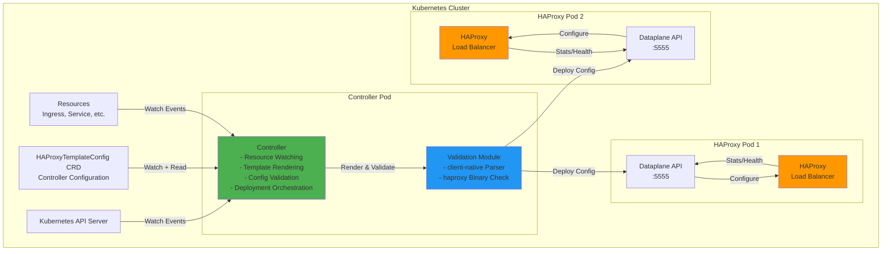
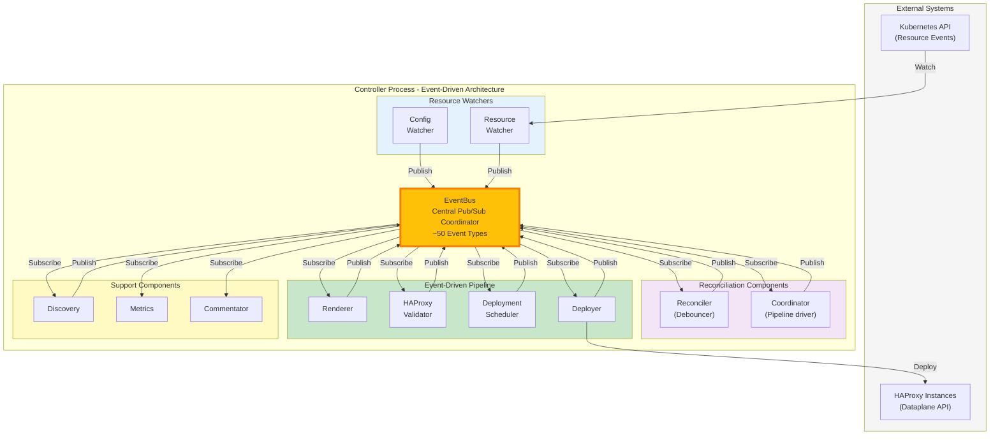
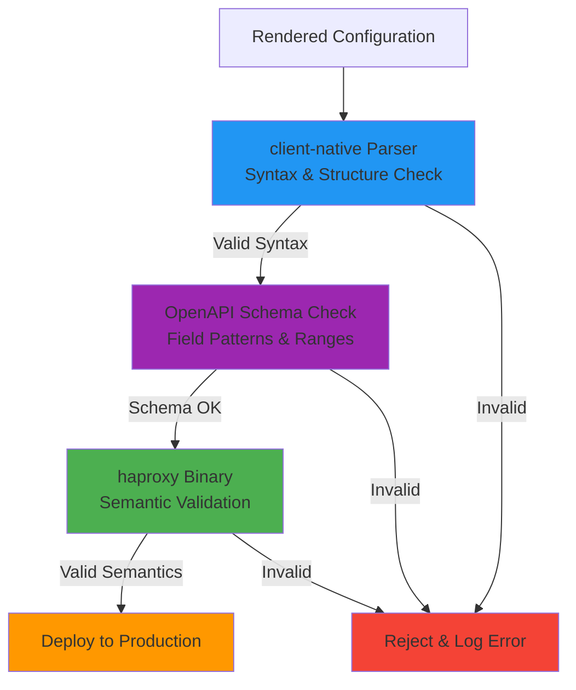

# Architecture Overview

## Overview

HAPTIC is a Kubernetes operator that manages HAProxy load balancer configurations through template-driven configuration generation. The system continuously monitors Kubernetes resources and translates them into HAProxy configuration files using a powerful templating engine.

**Core Capabilities:**

- **Template-Driven Configuration**: Uses a feature-rich template engine to generate HAProxy configurations from Kubernetes resources
- **Dynamic Resource Watching**: Monitors user-defined Kubernetes resource types (Ingress, Service, ConfigMap, custom CRDs)
- **Validation-First Deployment**: All configurations are parsed and validated before deployment to production instances
- **Zero-Reload Optimization**: Leverages HAProxy Runtime API for configuration changes that don't require process reloads
- **Structured Comparison**: Intelligently compares configurations to minimize deployments and maximize use of runtime operations

**Operational Model:**

The controller operates through event-driven coordination, with one synchronous service inside the leader: rendering and validation are *not* a multi-hop event chain, they're a single Pipeline call.

1. **Resource Watchers** (`pkg/k8s/watcher`, all-replica) monitor Kubernetes resources and publish `ResourceIndexUpdatedEvent` / `IndexSynchronizedEvent` to EventBus
2. **Reconciler** (`pkg/controller/reconciler.Reconciler`, all-replica) subscribes to those events, applies leading-edge refractory debouncing, and publishes `ReconciliationTriggeredEvent` (also fires immediately on `BecameLeaderEvent` to bootstrap the new leader)
3. **Coordinator** (`pkg/controller/reconciler.Coordinator`, **leader-only**) subscribes to `ReconciliationTriggeredEvent`, calls `Pipeline.Execute` synchronously — no event hop. The pipeline runs `RenderService.Render` + three-phase `ValidationService.Validate` (client-native parser syntax + OpenAPI schema + `haproxy -c` semantic) in one shot. The Coordinator then publishes `TemplateRenderedEvent` + `ValidationCompletedEvent` for downstream observers, and finally `ReconciliationCompletedEvent` (or `ReconciliationFailedEvent`) for metrics/commentator.
4. **DeploymentScheduler** (`pkg/controller/deployer.DeploymentScheduler`, **leader-only**) subscribes to those events plus `HAProxyPodsDiscoveredEvent`, enforces rate limiting (`minDeploymentInterval`), implements latest-wins coalescing, and publishes `DeploymentScheduledEvent`
5. **Deployer** (`pkg/controller/deployer.Component`, **leader-only**) subscribes to `DeploymentScheduledEvent`, executes parallel `dataplane.Sync` calls against every HAProxy endpoint, and publishes `DeploymentCompletedEvent` plus per-endpoint `InstanceDeployedEvent` / `InstanceDeploymentFailedEvent`
6. **All-replica observers** (Discovery, ConfigPublisher, StatusApplier, ProposalValidator, HTTPStore, Metrics, Commentator) subscribe to relevant events for their specific purposes and either react locally or — if leader-only writes are involved — let the leader-only sister component pick up the work

`pkg/controller/renderer.Component` and `pkg/controller/validator.HAProxyValidatorComponent` exist in the source tree as event-driven adapters but are **not constructed in production code**; the leader's synchronous Pipeline replaced them. They remain for test fixtures and historical reference.

**Key Design Principles:**

- **Fail-Safe**: Invalid configurations are rejected before reaching production
- **Performance**: Debouncing prevents rapid successive renders, indexing enables fast lookups
- **Observability**: Prometheus metrics, structured logging, and a `/debug/vars` introspection endpoint
- **Flexibility**: Templates provide complete control over HAProxy configuration, no annotation limitations

## Component Diagrams

### High-Level System Components

**Component Descriptions:**

- **Controller**: Main controller process that watches Kubernetes resources, renders templates, and orchestrates configuration deployment
- **Validation Module**: Integrated validation using haproxytech/client-native library for parsing and haproxy binary for configuration checks
- **Dataplane API**: HAProxy's management interface for receiving configuration updates and performing runtime operations
- **HAProxy**: Production load balancer instances that serve traffic

### Controller Internal Architecture

**Event-Driven Data Flow:**

The diagram above shows the conceptual flow; the production reality fuses Renderer + HAProxyValidator into the leader-only Coordinator's synchronous pipeline call.

1. **Config/Resource Watchers** receive Kubernetes changes and publish events to EventBus
2. **Reconciler** subscribes to change events, applies a leading-edge refractory debouncer (default 5s; see `pkg/k8s/types.DefaultDebounceInterval`), filters initial sync events, and publishes `ReconciliationTriggeredEvent`. Also fires on `BecameLeaderEvent` so a freshly-elected leader produces a current render instead of waiting for the next change.
3. **Coordinator** (leader-only) subscribes to `ReconciliationTriggeredEvent` and calls `pkg/controller/pipeline.Pipeline.Execute(ctx, storeProvider)` synchronously. The pipeline runs `RenderService.Render` + three-phase `ValidationService.Validate` in one atomic step. On success, the Coordinator publishes `TemplateRenderedEvent` + `ValidationCompletedEvent`; on failure, `ReconciliationFailedEvent` carrying a `*PipelineError` (use `errors.As` to extract the failed phase). Either path ends with `ReconciliationCompletedEvent` for metrics.
4. **DeploymentScheduler** (leader-only) subscribes to `TemplateRenderedEvent`, `ValidationCompletedEvent`, `HAProxyPodsDiscoveredEvent`, and `ConfigValidatedEvent`; enforces rate limiting (default 2s minimum interval), implements "latest wins" queueing, publishes `DeploymentScheduledEvent`
5. **Deployer** (leader-only) subscribes to `DeploymentScheduledEvent`, executes parallel `dataplane.Sync` calls to all HAProxy endpoints, publishes `InstanceDeployedEvent` / `InstanceDeploymentFailedEvent` per endpoint and `DeploymentCompletedEvent` overall
6. **Discovery** (all-replica) probes HAProxy pods, caches `HAProxyPodsDiscoveredEvent` via `leadership.StateReplayer` so the next leader gets current state on `BecameLeaderEvent`
7. **ConfigPublisher** (leader-only) subscribes to `TemplateRenderedEvent` + `ValidationCompletedEvent`, writes the rendered config + auxiliary files as observable CRDs (`HAProxyCfg`, `HAProxyMapFile`, …)
8. **Support Components** (Metrics, Commentator, StatusApplier) subscribe to relevant events for metrics / logs / status patches

**Key Architecture Properties:**

- **EventBus** is the single coordination mechanism - zero direct component-to-component function calls
- **Event-Driven Components** (Renderer, Validator, Scheduler, Deployer) are wrappers around pure libraries (pkg/templating, pkg/dataplane, pkg/k8s)
- **Pure Libraries** (pkg/templating, pkg/dataplane, pkg/k8s) contain testable business logic with no event dependencies
- **Event Adapters** translate between EventBus pub/sub and pure library function calls
- **Extensibility** - new features can subscribe to existing events without modifying existing code
- **Independent Testing** - pure libraries can be unit tested, event adapters can be integration tested

### Validation Flow

**Validation Strategy:**

Three phases run in-process, eliminating the need for a separate validation sidecar container:

1. **Phase 1 — Syntax parsing.** client-native parses the configuration and validates it against the HAProxy config grammar.
2. **Phase 1.5 — OpenAPI schema check.** The parsed structure is cross-checked against the version-specific DataPlane API OpenAPI spec — catches out-of-range values, pattern violations, and missing required fields before they reach HAProxy.
3. **Phase 2 — Semantic validation.** `haproxy -c -f config` performs full semantic validation including resource availability. Each call creates a per-process temp directory mirroring the production layout (`maps/`, `ssl/`, `general/`), writes the auxiliary files there, and rewrites the rendered config's `default-path origin <baseDir>` line to point at the temp dir — so file references resolve exactly like at runtime. File I/O is fully isolated per call, but the actual `haproxy -c` invocation is still serialised by a global `haproxyCheckMutex` (`pkg/dataplane/validate_haproxy.go`) because concurrent binary invocations have been observed to interfere with each other.

Results are cached by an SHA-256 over (config + auxiliary files) per instance — repeat validations during drift-prevention cycles short-circuit before touching disk. This provides the same guarantees as a full HAProxy instance while being lightweight and fast.
