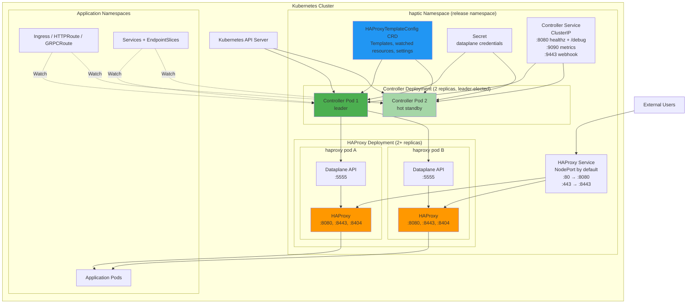
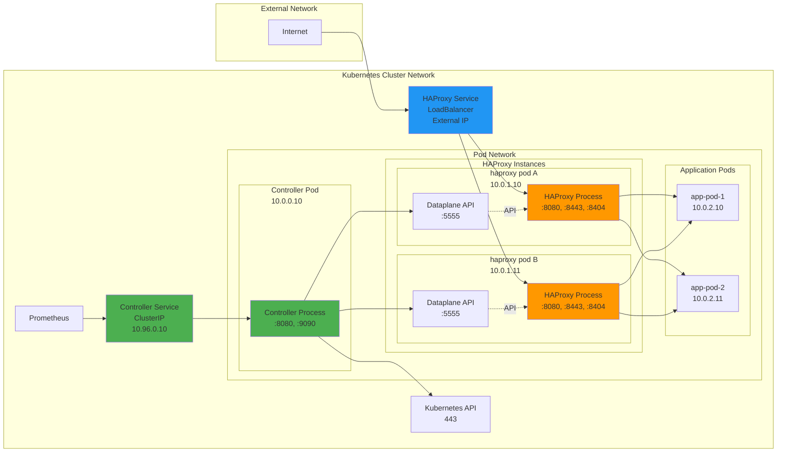

# Deployment Diagrams

## Kubernetes Deployment Architecture



**Deployment Components:**

1. **Controller Deployment** — defaults to 2 replicas with leader election
   - All replicas watch Kubernetes resources, run admission webhooks, and discover HAProxy pods (hot standby — keeps caches warm so failover is instant)
   - Only the elected leader runs the render-validate Pipeline and pushes configuration to HAProxy via Dataplane API
   - See [High Availability](../../operations/high-availability.md) for tuning failover and [Leader Election](./leader-election.md) for the full all-replica vs leader-only component split

2. **Controller Service** (ClusterIP) — operational endpoints only
   - `:8080` → healthz probes and `/debug/*` introspection
   - `:9090` → Prometheus metrics
   - `:9443` → validating webhook

3. **HAProxy Deployment** (not StatefulSet) — scales horizontally
   - Each pod runs HAProxy + the Dataplane API as a sidecar, sharing the config volume
   - Ready pods are auto-discovered via `controller.config.podSelector`

4. **HAProxy Service** — NodePort by default; set `haproxy.service.type: LoadBalancer` for cloud providers
   - Service port 80 maps to HAProxy container port 8080, service port 443 maps to 8443

5. **HAProxyTemplateConfig CRD** — holds every piece of configuration the controller needs
   - Template bodies (`haproxyConfig`, `templateSnippets`, `maps`, `files`, `sslCertificates`)
   - `watchedResources` (what to subscribe to and how to index it)
   - Dataplane tuning (`minDeploymentInterval`, `driftPreventionInterval`, storage paths)
   - Validation tests shipped alongside the templates

6. **Credentials Secret** referenced by `spec.credentialsSecretRef` — holds Dataplane API usernames/passwords. Watched live, so rotations don't require a restart.

## Container Architecture

```mermaid
graph TB
    subgraph "Controller Pod"
        CTRL_MAIN[Controller Process<br/>:8080 healthz + /debug<br/>:9090 metrics<br/>:9443 webhook]
        CTRL_TMP[/tmp emptyDir<br/>haproxy -c validation]
    end

    subgraph "HAProxy Pod (Deployment member)"
        HAP_PROC[HAProxy Process<br/>:8080 HTTP<br/>:8443 HTTPS<br/>:8404 Stats]
        DP_PROC[Dataplane API<br/>:5555 API<br/>Unix master socket]
        HAP_VOL[Shared config emptyDir<br/>/etc/haproxy<br/>maps/, ssl/, files/]
    end

    HTPLCFG[HAProxyTemplateConfig CRD] -. watch .-> CTRL_MAIN
    CREDS_SECRET[Credentials Secret] -. watch .-> CTRL_MAIN
    CTRL_TMP --> CTRL_MAIN

    DP_PROC <-. master socket .-> HAP_PROC
    HAP_VOL --> HAP_PROC
    HAP_VOL --> DP_PROC

    style CTRL_MAIN fill:#4CAF50
    style HAP_PROC fill:#FF9800
    style DP_PROC fill:#FFB74D
```

**Resource Requirements** (chart defaults; see [Performance Guide](../../operations/performance.md) for sizing by ingress count):

Controller Pod:

- CPU request `100m` (no CPU limit — avoids throttling; GOMAXPROCS auto-derived)
- Memory `512Mi` request = limit (Guaranteed QoS; GOMEMLIMIT auto-derived via automemlimit)
- `/tmp` emptyDir for transient `haproxy -c` validation; root filesystem is read-only

HAProxy Pod:

- HAProxy container: tuned by the chart; the main consumer is connection buffers
- Dataplane API sidecar: `50m` CPU request, `256Mi` memory request = limit
- Shared config volume (`emptyDir`) mounted at `/etc/haproxy`; both containers read/write it

## Network Topology



**Network Flow:**

1. **Ingress Traffic**: Internet → HAProxy Service (LoadBalancer) → HAProxy Pods → Application Pods
2. **Control Plane**: Controller → Kubernetes API (resource watching)
3. **Configuration Deployment**: Controller → Dataplane API endpoints (HTTP)
4. **Service Discovery**: Controller watches HAProxy pods via Kubernetes API
5. **Monitoring**: Prometheus → Controller Service (ClusterIP) → Controller Pod (metrics endpoint)
6. **Health Checks**: Kubernetes → Controller Service → Controller Pod (healthz endpoint)

**Scaling Considerations:**

- **HAProxy horizontal scaling**: `kubectl scale deployment <release>-haproxy --replicas=N` (or set `haproxy.replicaCount`). Pods are auto-discovered via `controller.config.podSelector`.
- **Controller horizontal scaling**: Run 2+ replicas with leader election (the chart default). Only the leader pushes configuration; followers are hot standby.
- **Resource sizing**: Scales with the number of watched resources and template complexity — see [Performance Guide](../../operations/performance.md) for per-size profiles.
- **Network topology**: Ensure LoadBalancer/NodePort can distribute traffic across all HAProxy replicas and that NetworkPolicy allows the controller to reach Dataplane API port 5555 on each HAProxy pod.
