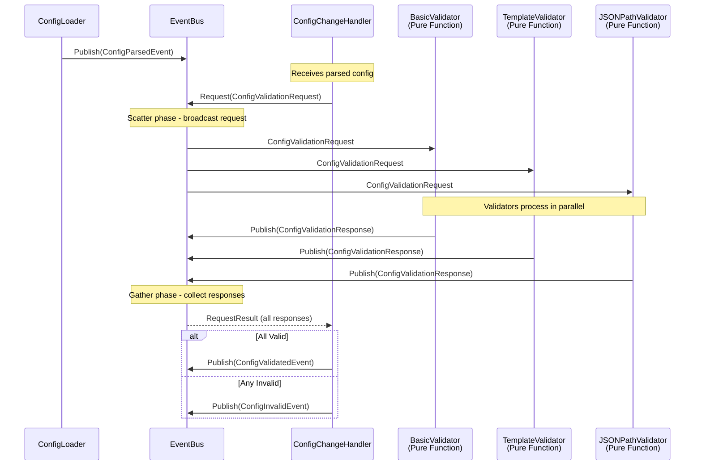

# Key Design Decisions

## Configuration Validation Strategy

**Decision**: Use in-process three-phase validation (client-native syntax parse + OpenAPI schema check + `haproxy -c` semantic check) instead of running a full validation sidecar.

**Rationale**:

- **Performance**: Parser validation is fast (~10ms), binary validation completes in ~50-100ms
- **Resource Efficiency**: No additional HAProxy container needed (saves ~256Mi memory per controller pod)
- **Simplicity**: Single container deployment reduces complexity
- **Reliability**: Same validation guarantees as full HAProxy instance

**Implementation**: lives in `pkg/dataplane/validator.go` plus `validate_syntax.go` / `validate_schema.go` / `validate_haproxy.go`. The leader-side reconciliation pipeline calls into it through `pkg/controller/validation.ValidationService`, which wraps caching and DNS-strictness on top.

```go
// pkg/dataplane/validator.go (real signatures — not just an illustration)
type ValidationPaths struct {
    TempDir           string // root tempdir; cleaned up by the validator
    MapsDir           string
    SSLCertsDir       string
    CRTListDir        string // may differ from SSLCertsDir on HAProxy < 3.2
    GeneralStorageDir string
    ConfigFile        string
}

type ValidationError struct {
    Phase   string // "syntax" / "schema" / "semantic"
    Message string
    Cause   error
}

// Returns the parsed *StructuredConfig from phase 1 so downstream callers
// can skip a re-parse. Cache hits return ErrValidationCacheHit (parsed nil).
func ValidateConfiguration(
    mainConfig string,
    auxFiles *AuxiliaryFiles,
    paths *ValidationPaths,
    version *Version,           // schema selector; nil falls back to v3.0
    skipDNSValidation bool,     // true for permissive (leader runtime); false for webhook
) (*parser.StructuredConfig, error)
```

The function checks a `(configHash, auxHash, versionHash)` cache first (so identical inputs during drift-prevention cycles skip every phase), then runs:

1. **Phase 1 — Syntax** via `validateSyntax(mainConfig)`. Returns the parsed `*parser.StructuredConfig` for phase 1.5.
2. **Phase 1.5 — OpenAPI schema** via `validateAPISchema(parsed, version)`.
3. **Phase 2 — Semantic** via `validateSemantics(...)`. Clears the supplied `ValidationPaths.{MapsDir, SSLCertsDir, GeneralStorageDir, CRTListDir}`, writes the auxiliary tree there, then calls `runHAProxyCheck` under a package-global mutex (`haproxyCheckMutex`) that serialises every concurrent `haproxy -c` invocation. The mutex protects the binary invocation, not the file writes — concurrent `haproxy -c` runs interfere with each other even with isolated paths.

Successful parses are cached; failures are not cached.

The pipeline-side `pkg/controller/validation.ValidationService` allocates a per-call `os.MkdirTemp` for `ValidationPaths`, rewrites the rendered config's `default-path origin <baseDir>` to point at the temp dir, and *also* keeps its own per-instance content-checksum cache (`SHA-256(config + auxFiles)`) on top of the dataplane-level cache. Net effect: drift-prevention cycles short-circuit twice (controller cache, then dataplane cache) before any file is written.

**Validation Paths Configuration**:

The validation paths must match the HAProxy Dataplane API server's resource configuration. They are set under `spec.dataplane` in the `HAProxyTemplateConfig` CRD:

```yaml
dataplane:
  mapsDir: /etc/haproxy/maps
  sslCertsDir: /etc/haproxy/ssl
  generalStorageDir: /etc/haproxy/general
  configFile: /etc/haproxy/haproxy.cfg
```

The package-global `haproxyCheckMutex` serialises the `haproxy -c` invocations (without it, concurrent runs interfere with each other even when the temp directories are isolated). It does *not* protect the file writes — those happen before the lock is acquired and against caller-supplied `ValidationPaths`, so callers that share paths across goroutines need their own coordination. In practice the controller wrapper hands every call its own `os.MkdirTemp`, so this only matters for direct library users.

**Parser Improvements**:

The config parser (`pkg/dataplane/parser`) has been enhanced to correctly handle all HAProxy global directives:

1. **Fixed Log Target Parsing**: Previously, the parser incorrectly treated `log-send-hostname` as a log target
   - Now correctly identifies log targets: lines starting with "log" followed by an address
   - Properly classifies `log-send-hostname` as a general global directive (not a log target)
   - Example valid config now parses correctly:

     ```
     global
         log stdout local0
         log-send-hostname
     ```

2. **Improved Directive Classification**: Enhanced logic to distinguish between:
   - Log targets: `log <address> <facility> [level]`
   - Log options: `log-send-hostname`, `log-tag`, etc.
   - Other global directives

3. **Better Error Messages**: Parser now provides clearer error messages when encountering unsupported directives

This fix resolves issues where valid HAProxy configurations were rejected during the parsing phase of validation.

## Template Engine Selection

**Decision**: Use Scriggo, a Go-native template engine with dynamic include support.

**Selected**: Scriggo (gitlab.com/haproxy-haptic/scriggo)

**Rationale**:

- **Dynamic Includes**: Supports runtime-resolved include paths via custom file system implementation
- **Active Maintenance**: Actively maintained with regular releases
- **Go-Native**: Pure Go implementation with Go-like template syntax
- **Features**: Full feature set including control flow, macros, and template inheritance
- **Extensibility**: Custom file systems enable dynamic template loading and include resolution
- **Pure Go**: No external dependencies

## Kubernetes Client Architecture

**Decision**: Use client-go with SharedInformerFactory for resource watching, no heavy controller framework.

**Rationale**:

- **Control**: Direct control over informer lifecycle and event handling
- **Flexibility**: Custom indexing logic without framework constraints
- **Performance**: Optimized cache and index management
- **Simplicity**: No code generation, no framework-imposed structure

**Implementation Pattern**:

```go
// Slim approach using client-go
factory := informers.NewSharedInformerFactory(clientset, resyncPeriod)

// Add informers for each watched resource type
for _, resource := range config.WatchedResources {
    gvr := schema.GroupVersionResource{...}
    informer := factory.ForResource(gvr)

    informer.Informer().AddEventHandler(cache.ResourceEventHandlerFuncs{
        AddFunc:    handleAdd,
        UpdateFunc: handleUpdate,
        DeleteFunc: handleDelete,
    })
}

factory.Start(stopCh)
```

## Concurrency Model

**Decision**: Use Go routines and channels for async operations with structured concurrency.

**Key Patterns**:

1. **Event Processing**: Buffered channels for event debouncing

   ```go
   type Debouncer struct {
       events chan Event
       timer  *time.Timer
   }
   ```

2. **Parallel Deployment**: Worker pools for deploying to multiple HAProxy instances

   ```go
   var wg sync.WaitGroup
   for _, endpoint := range endpoints {
       wg.Add(1)
       go func(ep DataplaneEndpoint) {
           defer wg.Done()
           deploy(ep)
       }(endpoint)
   }
   wg.Wait()
   ```

3. **Context Propagation**: All operations use context.Context for cancellation

   ```go
   func (d *Deployer) Deploy(ctx context.Context, config Config) error {
       ctx, cancel := context.WithTimeout(ctx, 30*time.Second)
       defer cancel()
       // ... deployment logic
   }
   ```

## Observability Integration

**Decision**: Prometheus metrics + structured `log/slog` logging with rich contextual fields and event correlation via the `EventCommentator`. Distributed tracing is out of scope for now — the controller does not emit OpenTelemetry spans.

**Metrics Implementation**:

The controller implements comprehensive Prometheus metrics through the event adapter pattern:

**Architecture**:

- `pkg/metrics`: Generic metrics infrastructure with instance-based registry
- `pkg/controller/metrics`: Event adapter subscribing to controller lifecycle events
- Metrics exposed on configurable port (default 9090) at `/metrics` endpoint

**Implementation** (real signatures — see `pkg/controller/controller.go` for the production wiring):

```go
// Instance-based registry — created fresh each iteration so reinit drops
// stale state cleanly.
metricsRegistry := prometheus.NewRegistry()

// Two-step construction: pure metrics struct first, then the event adapter.
domainMetrics := metrics.NewMetrics(metricsRegistry)               // *Metrics
metricsComponent := metrics.New(domainMetrics, eventBus)            // *Component

// Subscription happened in metrics.New(...). Start() blocks on the event loop.
go metricsComponent.Start(ctx)

// HTTP server lives in pkg/metrics; the long-lived Server outlives the
// per-iteration registry, so it's constructed once at startup with a
// process-lifetime registry.
metricsServer := pkgmetrics.NewServer(":9090", metricsRegistry)
go metricsServer.Start(ctx)
```

**Metrics exposed** (36 metrics total — see `pkg/controller/metrics/README.md` for the full catalogue; `pkg/controller/metrics/metrics.go` itself is the authoritative list. `TestMetrics_AllMetricsRegistered` covers a representative subset, not every metric). Key groups:

1. **Reconciliation**:
   - `haptic_reconciliation_total`, `haptic_reconciliation_errors_total`, `haptic_reconciliation_duration_seconds`
   - `haptic_reconciliation_queue_wait_seconds`

2. **Deployment**:
   - `haptic_deployment_total`, `haptic_deployment_errors_total`, `haptic_deployment_duration_seconds`

3. **Validation**:
   - `haptic_validation_total`, `haptic_validation_errors_total`

4. **Resources**:
   - `haptic_resource_count` (gauge vector labeled by `type`, including `haproxy-pods` and every `watchedResources` key)

5. **Event bus**:
   - `haptic_event_subscribers`, `haptic_events_published_total`
   - Drops: `haptic_events_dropped_total`, `..._dropped_critical_total`, `..._dropped_by_subscriber_total`, `..._dropped_observability_total`

6. **Leader election**:
   - `haptic_leader_election_is_leader`, `haptic_leader_election_transitions_total`, `haptic_leader_election_time_as_leader_seconds_total`

7. **Webhook**:
   - `haptic_webhook_requests_total`, `haptic_webhook_request_duration_seconds`, `haptic_webhook_validation_total`

8. **Parser cache**:
   - `haptic_parser_cache_hits_total`, `haptic_parser_cache_misses_total`

9. **Build info**:
   - `haptic_build_info` (labels: `version`, `haproxy_version`, `go_version`)

**Logging + event correlation (instead of distributed tracing)**:

Rather than emitting OpenTelemetry spans, the controller wires per-operation context into its structured logs. The `EventCommentator` (`pkg/controller/commentator`) subscribes to the full EventBus stream, buffers events in a ring buffer, and produces domain-aware log lines that correlate each reconciliation to the change that triggered it.

```go
logger := slog.Default().With(
    "component", "renderer",
    "namespace", ingress.Namespace,
    "name",      ingress.Name,
)

func (r *Renderer) Render(ctx context.Context, tpl string, rc RenderContext) (string, error) {
    start := time.Now()
    output, err := r.engine.Render(ctx, tpl, rc)
    logger.Info("template rendered",
        "template", tpl,
        "output_bytes", len(output),
        "duration_ms", time.Since(start).Milliseconds(),
    )
    return output, err
}
```

If the deployment later requires end-to-end trace correlation across controller and HAProxy, OTel integration would be added as a separate component adapter subscribing to the same EventBus stream.

## Error Handling Strategy

**Decision**: Structured errors with context using standard library errors package and custom error types.

**Pattern** (sketched against the real types in `pkg/dataplane/errors.go`):

```go
// ValidationError represents semantic validation failure from HAProxy.
type ValidationError struct {
    Phase   string  // "syntax" or "semantic"
    Message string
    Cause   error
}

func (e *ValidationError) Error() string {
    if e.Phase != "" {
        return fmt.Sprintf("%s validation failed: %s: %v", e.Phase, e.Message, e.Cause)
    }
    return fmt.Sprintf("HAProxy validation failed: %s: %v", e.Message, e.Cause)
}

func (e *ValidationError) Unwrap() error { return e.Cause }

// Usage at the boundary between parser and caller (see pkg/dataplane/validate_*.go):
func validateSyntax(config string) error {
    if err := parser.Parse(config); err != nil {
        return &ValidationError{Phase: "syntax", Message: "parser rejected config", Cause: err}
    }
    return nil
}
```

`pkg/dataplane` also defines `*ParseError` for `client-native` parser failures, and `pkg/templating` defines `*RenderError` / `*CompilationError` / `*RenderTimeoutError` / `*TemplateNotFoundError` for the template engine. Each carries a `Cause`, so `errors.As` and `errors.Is` chains continue to work end-to-end.

## Event-Driven Architecture

**Decision**: Implement event-driven architecture for component decoupling and extensibility.

**Rationale**:

- **Decoupling**: Components communicate via events, not direct calls
- **Extensibility**: New features can be added without modifying existing code
- **Observability**: Complete system visibility through event stream
- **Testability**: Pure components without event dependencies
- **Maintainability**: Clear separation between business logic and coordination

**Architecture Pattern**:

The architecture splits responsibilities into pure libraries, a synchronous render-validate pipeline driven by the leader-only Coordinator, and event-driven components for everything that requires cross-component coordination:

```
Component Architecture:
├── Pure Libraries (business logic, no event dependencies)
│   ├── pkg/templating - Template engine with pre-compilation and rendering
│   ├── pkg/dataplane - HAProxy config validation, parsing, and deployment
│   ├── pkg/k8s - Resource watching, indexing, and storage
│   └── pkg/core - Configuration types and basic validation
│
├── Synchronous Pipeline (leader-only, called via direct function call — no event hop)
│   ├── pkg/controller/renderer.RenderService - templates → haproxy.cfg + auxiliary files
│   ├── pkg/controller/validation.ValidationService - three-phase validation with caching
│   └── pkg/controller/pipeline.Pipeline - composes the two above + checksum
│
└── Event-Driven Components (event adapters wrapping pure libraries / pipeline)
    ├── pkg/controller/reconciler - Reconciler debounces; Coordinator drives the pipeline (leader-only)
    ├── pkg/controller/deployer - DeploymentScheduler + Deployer + DriftMonitor around pkg/dataplane (leader-only)
    ├── pkg/controller/discovery - HAProxy pod probing; caches event for state replay
    ├── pkg/controller/configpublisher - publishes HAProxyCfg + auxiliary CRDs (leader-only)
    ├── pkg/controller/dryrunvalidator + proposalvalidator - admission-webhook integration
    ├── pkg/controller/httpstore - background HTTP refresh + two-version cache
    ├── pkg/controller/statusapplier - SSA-applies template-driven status patches (leader-only writes)
    ├── pkg/controller/commentator - Domain-aware logging of every event for correlation
    └── pkg/controller/metrics - Subscribes to lifecycle events, updates Prometheus metrics
```

**Key Distinction**:

- **Pure Libraries**: Testable business logic with no EventBus dependencies (`pkg/templating`, `pkg/dataplane`, `pkg/k8s`).
- **Synchronous Pipeline**: One direct function call inside the leader-only Coordinator. Render + validate is a single atomic step rather than two event-driven hops, because admission decisions and reconciliation decisions must agree.
- **Event-Driven Components**: Coordination across components, observability, and webhook flows (`pkg/controller/*`). Rendering and HAProxy-config validation have no event-adapters in production — they run synchronously inside the Pipeline.

**Homegrown Event Bus Implementation** (real shape — see `pkg/events/bus.go`):

```go
// pkg/events/bus.go
package events

// Event interface for type safety and immutability
//
// All event types MUST use pointer receivers for Event interface methods.
// All event types MUST implement both methods:
//   - EventType() returns the unique event type string
//   - Timestamp() returns when the event was created
//
// Events are immutable after creation. Constructor functions perform defensive
// copying of slices and maps to prevent post-publication mutation.
type Event interface {
    EventType() string
    Timestamp() time.Time
}

// EventBus provides pub/sub + scatter-gather coordination with startup buffering
// and a Pause/Resume hook for leadership transitions.
type EventBus struct {
    subscribers      []subscriber           // universal subs (carries lossy flag, name, channel)
    typedSubscribers []*typedSubscription   // type-filtered (SubscribeTypes / Subscribe[T])
    mu               sync.RWMutex

    // Startup coordination + Pause/Resume.
    // Pause() returns the bus to buffering mode; Start() flushes the buffer
    // to all subscribers. Used during leadership transitions so leader-only
    // components subscribe before the BecameLeaderEvent is replayed.
    started        bool
    startMu        sync.Mutex
    preStartBuffer []Event

    // Drop accounting — separated by criticality so observability noise
    // doesn't trigger the same alerts as real backpressure problems.
    droppedEventsCritical      uint64       // atomic; SubscribeLossy never increments this
    droppedEventsObservability uint64       // atomic; from lossy subscribers
    onDrop                     DropCallback // fires only on critical drops
}
```

`Publish` is non-blocking and returns the number of subscribers that received the event (`int`, not `error`). Pre-start buffered events return `0`. The Pause/Resume contract is documented in `pkg/controller/leaderelection/CLAUDE.md` — it's the mechanism that keeps leader-only components from racing against the very `BecameLeaderEvent` that's supposed to start them.

`Subscribe` is `Subscribe(name string, bufferSize int) <-chan Event` — the `name` shows up in drop-callback diagnostics so a slow subscriber is identifiable. There are also typed (`SubscribeTypes`, `Subscribe[T]`) and lossy (`SubscribeLossy`, `SubscribeTypesLossy`) variants. See `pkg/events/CLAUDE.md` for the full surface.

**Event Type Definitions**:

The full catalog of event-type constants (~45 in total) lives in `pkg/controller/events/types.go`; the structs and constructors are split across category files (`config.go`, `resource.go`, `reconciliation.go`, `template.go`, `validation.go`, `deployment.go`, `discovery.go`, `credentials.go`, `leader.go`, `publishing.go`, `http.go`, `proposal.go`, `status.go`).

Every event type follows the same shape:

```go
// pkg/controller/events/<category>.go
package events

// Exported fields for event data; unexported `timestamped` mixes in Timestamp().
type ConfigParsedEvent struct {
    Config         any    // parsed config (any to avoid circular deps)
    TemplateConfig any    // original CRD (for k8s metadata)
    Version        string // HAProxyTemplateConfig CRD resourceVersion
    SecretVersion  string // credentials Secret resourceVersion
    timestamped
}

// Constructor performs defensive copying of slices/maps where present.
func NewConfigParsedEvent(config, templateConfig any, version, secretVersion string) *ConfigParsedEvent {
    return &ConfigParsedEvent{
        Config:         config,
        TemplateConfig: templateConfig,
        Version:        version,
        SecretVersion:  secretVersion,
        timestamped:    newTimestamped(),
    }
}

// Pointer receiver for the Event interface method.
func (e *ConfigParsedEvent) EventType() string { return EventTypeConfigParsed }
```

Categories include configuration, resource indexing, reconciliation, template rendering, three-phase validation, deployment, HAProxy pod discovery, credentials, leader election, config publishing, webhook validation (observability only — admission validation itself is a synchronous library call, see ADR-0001), HTTP resources, proposal validation, and status patches. Refer to the source for exact field shapes — they evolve more often than this design doc does.

**Event Immutability Contract**:

Events in the system are designed to be immutable after creation, representing historical facts about what happened. The implementation balances practical immutability with Go idioms and performance:

1. **Pointer Receivers**: All Event interface methods use pointer receivers
   - Avoids copying large structs (many events exceed 200 bytes)
   - Follows Go best practices for methods on types with mutable fields
   - Enforced by custom `eventimmutability` linter in `tools/linters/`

2. **Exported Fields**: Event fields are exported for idiomatic Go access
   - Follows industry standards (Kubernetes, NATS)
   - Enables JSON serialization without reflection tricks
   - Relies on team discipline rather than compiler enforcement

3. **Defensive Copying**: Constructors perform defensive copies of slices and maps
   - Publishers cannot modify events after creation
   - Example: `NewConfigInvalidEvent` deep-copies the validation errors map
   - Prevents accidental mutation from affecting published events

4. **Read-Only Discipline**: Consumers must treat events as read-only
   - Enforced through code review and team practices
   - This is an internal project where all consumers are controlled
   - Alternative (unexported fields + getters) would be less idiomatic Go

5. **Custom Linter**: The `eventimmutability` analyzer enforces pointer receivers
   - Integrated into `make lint` and CI pipeline
   - Prevents value receivers that would cause struct copying
   - Located in `tools/linters/eventimmutability/`

This approach provides practical immutability while maintaining clean, idiomatic Go code without the overhead of getters or complex accessor patterns.

**Component with Event Adapter Pattern**:

The pure library lives in `pkg/dataplane`; the event adapter lives in `pkg/controller/deployer`. This is mandated by the architecture rule "domain libraries have no EventBus dependency" — `pkg/dataplane` itself never imports `pkg/events`, so the adapter cannot live there.

```go
// pkg/dataplane (pure library — no event knowledge):
client, err := dataplane.NewClient(ctx, endpoint)            // *dataplane.Client
result, err := client.Sync(ctx, config, auxFiles, opts)      // *dataplane.SyncResult
```

```go
// pkg/controller/deployer/component.go (event adapter — real shape, see source).
// Subscribes inside Start() (leader-only contract); calls dataplane.Sync via
// the per-endpoint clients it constructs from HAProxyPodsDiscoveredEvent.
type Component struct {
    eventBus                  *busevents.EventBus
    logger                    *slog.Logger
    reloadVerificationTimeout time.Duration
    syncTimeout               time.Duration
    // ... per-endpoint clients, version cache, in-flight tracking, ...
}

func New(eventBus *busevents.EventBus, logger *slog.Logger, opts SyncOptions) *Component { ... }

// Sketch of one Sync invocation, distilled from pkg/controller/deployer/component.go:
func (c *Component) deployToEndpoint(ctx context.Context, ep dataplane.Endpoint, cfg string, aux *dataplane.AuxiliaryFiles) {
    c.eventBus.Publish(events.NewDeploymentStartedEvent(...))
    result, err := client.Sync(ctx, cfg, aux, &dataplane.SyncOptions{
        Timeout:                   c.syncTimeout,
        VerifyReload:              true,
        ReloadVerificationTimeout: c.reloadVerificationTimeout,
    })
    if err != nil {
        c.eventBus.Publish(events.NewInstanceDeploymentFailedEvent(ep, err))
        return
    }
    c.eventBus.Publish(events.NewInstanceDeployedEvent(ep, result))
}
```

**Staged Startup with Event Coordination**:

```go
// Sketch — the staged startup actually lives in pkg/controller/iteration.go;
// cmd/controller/main.go is a thin Cobra wrapper that calls into the
// controller package. This is the per-iteration shape.
func main() {
    ctx := context.Background()

    // Create event bus
    eventBus := events.NewEventBus(1000)

    // Stage 1: Config Management Components
    log.Info("Stage 1: Starting config management")

    // SingleWatcher subscriptions feed CRD/Secret bytes into the loaders
    // (see pkg/controller/iteration.go for the real wiring).
    configLoader := configloader.NewConfigLoaderComponent(eventBus, logger)
    credentialsLoader := credentialsloader.NewCredentialsLoaderComponent(eventBus, logger)

    // Three validators subscribe to ConfigValidationRequest via their shared BaseValidator;
    // the ConfigChangeHandler is the orchestrator that fans the request out to them.
    validator.NewBasicValidator(eventBus, logger)
    validator.NewTemplateValidator(eventBus, logger)
    validator.NewJSONPathValidator(eventBus, logger)
    configValidator := configchange.NewConfigChangeHandler(eventBus, logger, configChangeCh,
        []string{"basic", "template", "jsonpath"}, 0 /* default reinit debounce */)

    go configLoader.Start(ctx)
    go credentialsLoader.Start(ctx)
    go configValidator.Start(ctx)

    // Start the event bus - ensures all components have subscribed before events flow
    // This prevents race conditions where events are published before subscribers connect
    eventBus.Start()

    // Stage 2: Wait for Valid Config
    log.Info("Stage 2: Waiting for valid configuration")

    events := eventBus.Subscribe("startup", 100)
    var config Config

    for {
        select {
        case event := <-events:
            switch e := event.(type) {
            case ConfigValidatedEvent:
                config = e.Config
                log.Info("Valid config received")
                goto ConfigReady
            case ControllerShutdownEvent:
                return
            }
        case <-ctx.Done():
            return
        }
    }

ConfigReady:
    eventBus.Publish(ControllerStartedEvent{
        ConfigVersion: config.Version,
    })

    // Stage 3: Resource Watchers
    log.Info("Stage 3: Starting resource watchers")

    stores := make(map[string]*ResourceStore)
    resourceWatcher := NewResourceWatcher(client, eventBus, config.WatchedResources, stores)

    go resourceWatcher.Start(ctx)

    indexTracker := NewIndexSynchronizationTracker(eventBus, config.WatchedResources)
    go indexTracker.Start(ctx)

    // Stage 4: Wait for Index Sync
    log.Info("Stage 4: Waiting for resource sync")

    for {
        select {
        case event := <-events:
            if _, ok := event.(IndexSynchronizedEvent); ok {
                goto IndexReady
            }
        case <-time.After(30 * time.Second):
            log.Fatal("Index sync timeout")
        }
    }

IndexReady:

    // Stage 5: Reconciliation Components
    log.Info("Stage 5: Starting reconciliation")

    reconciler := reconciler.New(eventBus, logger)
    coordinator := reconciler.NewCoordinator(&reconciler.CoordinatorConfig{
        EventBus:      eventBus,
        Pipeline:      pipeline,
        StoreProvider: storeProvider,
        Logger:        logger,
    })

    go reconciler.Start(ctx)
    go coordinator.Start(ctx)

    log.Info("All components started")

    // Wait for shutdown
    <-ctx.Done()
}
```

**Event Multiplexing with `select`** (illustrative — see `pkg/controller/reconciler/reconciler.go` for the real `Reconciler.Start` loop, which uses a typed subscription):

```go
// pkg/controller/reconciler/reconciler.go (illustrative)
type Reconciler struct {
    eventBus *EventBus
    logger   *slog.Logger
}

func (r *Reconciler) Start(ctx context.Context) error {
    events := r.eventBus.SubscribeTypes("reconciler", 100,
        EventTypeResourceIndexUpdated, EventTypeIndexSynchronized,
        EventTypeHTTPResourceUpdated, EventTypeHTTPResourceAccepted,
        EventTypeDriftPreventionTriggered, EventTypeBecameLeader,
    )

    for {
        select {
        case event := <-events:
            switch e := event.(type) {
            case *ResourceIndexUpdatedEvent:
                // Fire immediately. There is no reconciler-level refractory
                // window: burst coalescing is the per-watcher debounce
                // window's job, reload throttling is the deployer's.
                // Only the initial-sync variant is filtered out.
                r.triggerNow(e.EventType())

            case *IndexSynchronizedEvent, *BecameLeaderEvent, *DriftPreventionTriggeredEvent:
                // Whole-store state transitions reconcile immediately too.
                r.triggerNow(e.EventType())
            }

        case <-ctx.Done():
            return ctx.Err()
        }
    }
}
```

**Graceful Shutdown with Context**:

```go
// Illustrative — the actual implementation is the package-level
// `controller.Run` function in pkg/controller/controller.go (no
// Controller struct), which composes pkg/controller/iteration.go
// (`runIteration`) inside its reinitialization loop.
func (r *OperatorRunner) Run(ctx context.Context) error {
    eventBus := events.NewEventBus(1000)

    // Create cancellable context for components
    compCtx, cancel := context.WithCancel(ctx)
    defer cancel()

    // Start components
    g, gCtx := errgroup.WithContext(compCtx)

    g.Go(func() error { return configWatcher.Start(gCtx) })
    g.Go(func() error { return resourceWatcher.Start(gCtx) })
    g.Go(func() error { return reconciler.Start(gCtx) })

    // Wait for shutdown signal or component error
    select {
    case <-ctx.Done():
        log.Info("Shutdown signal received")
        eventBus.Publish(ControllerShutdownEvent{})

    case <-gCtx.Done():
        log.Error("Component error", "err", gCtx.Err())
    }

    // Cancel all components and wait
    cancel()
    return g.Wait()
}
```

**Benefits of This Approach**:

1. **Pure Components**: Business logic has no event dependencies, easily testable
2. **Single Event Layer**: Only adapters know about events, components remain clean
3. **Observability**: Complete system state visible through event stream
4. **Extensibility**: New features subscribe to existing events, no code modification
5. **Debugging**: Event log provides complete audit trail
6. **Idiomatic Go**: Uses channels, select, context - native Go patterns

## Request-Response Pattern (Scatter-Gather)

**Problem**: Configuration validation requires synchronous coordination across multiple validators (template syntax, JSONPath expressions, structural validation). Using async pub/sub with manual timeout management would add complexity and be error-prone.

**Solution**: Implement the scatter-gather pattern alongside async pub/sub for cases requiring coordinated responses.

**Pattern**: Scatter-Gather (from Enterprise Integration Patterns)

The scatter-gather pattern broadcasts a request to multiple recipients and aggregates responses:

1. **Scatter Phase**: Broadcast request event to all subscribers
2. **Gather Phase**: Collect response events correlated by RequestID
3. **Aggregation**: Wait for all (or minimum) expected responses or timeout

**When to Use**:

- **Configuration Validation**: Multiple validators must approve before config becomes active
- **Distributed Queries**: Need responses from multiple components before proceeding
- **Coordinated Operations**: Any scenario requiring confirmation from multiple parties

**When NOT to Use**:

- **Fire-and-Forget Notifications**: Use async pub/sub instead
- **Observability Events**: Use async pub/sub instead
- **Single Response**: Use direct function call instead

**Implementation**:

The EventBus provides both patterns:

```go
// pkg/events/bus.go (real signatures)

// Async pub/sub
func (b *EventBus) Publish(event Event) int
func (b *EventBus) Subscribe(name string, bufferSize int) <-chan Event
// Plus typed (SubscribeTypes, generic Subscribe[T]) and lossy (SubscribeLossy)
// variants — see pkg/events/CLAUDE.md for the full surface.

// Sync request-response
func (b *EventBus) Request(ctx context.Context, request Request, opts RequestOptions) (*RequestResult, error)
```

**Request/Response Interfaces**:

```go
// Request interface for scatter-gather
type Request interface {
    Event
    RequestID() string  // Unique ID for correlating responses
}

// Response interface
type Response interface {
    Event
    RequestID() string  // Links back to request
    Responder() string  // Who sent this response
}

// RequestOptions configures scatter-gather behavior
type RequestOptions struct {
    Timeout            time.Duration  // Max wait time
    ExpectedResponders []string       // Who should respond
    MinResponses       int            // Minimum required (for graceful degradation)
}

// RequestResult aggregates all responses
type RequestResult struct {
    Responses []Response  // All responses received
    Errors    []string    // Missing/timeout responders
}
```

**Config Validation Flow with Scatter-Gather**:



**Pure Packages + Event Adapters**:

All business logic packages remain event-agnostic. Only the `controller` package contains event adapters:

```
pkg/templating/                      # Pure: engine compiles + renders; no validator function.
                                     # The controller calls templating.NewScriggoWithDeclarations
                                     # against the full template set so cross-snippet refs resolve.

pkg/k8s/indexer/
  validation.go                      # Pure: ValidateJSONPath(expr string) error

pkg/core/config/
  validator.go                       # Pure: ValidateStructure(cfg *Config) error (same package)

pkg/controller/validator/            # Event-adapter responders for the scatter-gather
  base.go                            # Shared BaseValidator scaffold (subscription + dispatch)
  basic.go                           # BasicValidator   → core/config.ValidateStructure
  template.go                        # TemplateValidator → templating.NewScriggoWithDeclarations
  jsonpath.go                        # JSONPathValidator → k8s/indexer.ValidateJSONPath

pkg/controller/configchange/
  handler.go                         # ConfigChangeHandler — fans the request out via bus.Request,
                                     # aggregates responses, publishes ConfigValidatedEvent /
                                     # ConfigInvalidEvent
```

There is no `pkg/controller/validator/coordinator.go`; the orchestrator that drives the scatter-gather lives in `pkg/controller/configchange/handler.go`. Likewise there is no `pkg/templating.ValidateTemplates` — the controller's `TemplateValidator` validates by *compiling the entire template set together* (via `helpers.ExtractTemplatesFromConfig` + `templating.NewScriggoWithDeclarations`), so snippets that reference each other through `render`, `import`, or `inherit_context` resolve correctly.

**Event Adapter Example** (paraphrased from `pkg/controller/validator/template.go` — the production code is the source of truth):

```go
// pkg/controller/validator/template.go (paraphrased; see source for the full body)
type TemplateValidator struct {
    *BaseValidator
    eventBus *busevents.EventBus
    logger   *slog.Logger
}

func NewTemplateValidator(eventBus *busevents.EventBus, logger *slog.Logger) *TemplateValidator {
    v := &TemplateValidator{eventBus: eventBus, logger: logger}
    // BaseValidator subscribes the component to ConfigValidationRequest and
    // dispatches to v.HandleRequest below.
    v.BaseValidator = NewBaseValidator(eventBus, logger, ValidatorNameTemplate, "Template syntax validator", v)
    return v
}

func (v *TemplateValidator) HandleRequest(req *events.ConfigValidationRequest) {
    cfg, ok := req.Config.(*coreconfig.Config)
    if !ok { /* publish failure response, return */ }

    // Extract templates + entry points the same way production does
    extraction := helpers.ExtractTemplatesFromConfig(cfg)

    // Compile the whole set together — cross-snippet refs (render/import/
    // inherit_context) resolve only when every template is present.
    _, err := templating.NewScriggoWithDeclarations(
        extraction.AllTemplates, extraction.EntryPoints, nil, nil, nil,
        map[string]any{"currentConfig": (*parserconfig.StructuredConfig)(nil)},
    )

    var errs []string
    if err != nil {
        errs = []string{templating.FormatCompilationError(err, "templates", "")}
    }
    v.eventBus.Publish(events.NewConfigValidationResponse(
        req.RequestID(), ValidatorNameTemplate, len(errs) == 0, errs,
    ))
}
```

**Validation Coordination with Scatter-Gather**:

The orchestration lives in `pkg/controller/configchange.ConfigChangeHandler` (not in `pkg/controller/validator/`). The handler subscribes to `ConfigParsedEvent`, fans out a `ConfigValidationRequest` via `bus.Request`, and aggregates the responses from each validator into either `ConfigValidatedEvent` or `ConfigInvalidEvent`.

```go
// Pseudo-code mirroring pkg/controller/configchange/handler.go
func (h *ConfigChangeHandler) handleParsed(ctx context.Context, parsed *events.ConfigParsedEvent) {
    req := events.NewConfigValidationRequest(parsed.Config, parsed.Version)

    result, err := h.eventBus.Request(ctx, req, busevents.RequestOptions{
        Timeout:            10 * time.Second,
        ExpectedResponders: h.validators, // []string{"basic", "template", "jsonpath"}
    })

    if err != nil || hasInvalid(result.Responses) {
        // NewConfigInvalidEvent's third arg is map[string][]string keyed by validator name.
        h.eventBus.Publish(events.NewConfigInvalidEvent(parsed.Version, parsed.TemplateConfig, collectErrors(result, err)))
        return
    }

    // NewConfigValidatedEvent threads the typed CRD wrapper plus both resourceVersion strings
    // (CRD + credentials Secret) so downstream subscribers can correlate.
    h.eventBus.Publish(events.NewConfigValidatedEvent(parsed.Config, parsed.TemplateConfig, parsed.Version, parsed.SecretVersion))
}
```

The three validators that respond — `BasicValidator`, `TemplateValidator`, `JSONPathValidator` — all live in `pkg/controller/validator/` and share a `BaseValidator` that subscribes them to `ConfigValidationRequest`. To add a new validator: drop in a new `*Validator` constructor that wraps `NewBaseValidator(...)`, then add its name to the `validators` slice passed to `configchange.NewConfigChangeHandler`.

**Validator Logging Improvements**:

The handler implements enhanced logging to provide visibility into the scatter-gather validation process:

1. **Structured Logging**: Uses `log/slog` with structured fields for queryability
   - Validator names, response counts, validation error counts
   - Duration tracking for performance monitoring
   - Clear distinction between validation failure (expected) and system errors

2. **Appropriate Log Levels**:
   - `warn` level for validation failures (not `error`) - invalid config is an expected condition
   - `info` level for successful validation with validator details
   - `error` level reserved for actual system failures (timeouts, missing validators)

3. **Detailed Error Aggregation**:
   - Groups validation errors by validator name
   - Shows which validators responded and their individual results
   - Provides actionable error messages for config authors

4. **Observability**: Full visibility into validation workflow
   - Which validators participated in validation
   - How long validation took
   - Exactly which aspects of config failed validation

Example log output for validation failure:

```
level=warn msg="configuration validation failed"
  version="abc123"
  validators_responded=["basic","template","jsonpath"]
  validators_failed=["template","jsonpath"]
  error_count=3
  validation_errors={"template":["syntax error at line 5"],"jsonpath":["invalid expression: .foo[bar"]}
```

**Benefits**:

1. **No Manual Timeout Management**: EventBus handles timeout and response correlation
2. **Pure Packages**: Business logic has zero event dependencies
3. **Clean Separation**: Only controller package contains event glue code
4. **Standard Pattern**: Scatter-gather is well-documented in Enterprise Integration Patterns
5. **Flexible**: Can require all responses or gracefully degrade with partial responses
6. **Testable**: Pure functions easily tested without event infrastructure

**Comparison to Alternatives**:

| Approach | Pros | Cons |
|----------|------|------|
| **Scatter-Gather** | Standard pattern, built-in timeout, clean code | Slight overhead vs direct calls |
| **Manual Aggregator** | More control | Complex timeout logic, error-prone |
| **Direct Function Calls** | Simplest, fastest | Creates package dependencies |
| **Channels** | Go-native | No event stream visibility |

**Selected**: Scatter-gather provides the best balance of simplicity, observability, and maintainability.

## Event Commentator Pattern

**Decision**: Implement a dedicated Event Commentator component that subscribes to all EventBus events and produces domain-aware log messages with contextual insights.

**Problem**: Traditional logging approaches have several limitations:

- Debug log statements clutter business logic code
- Logs lack cross-event context and domain knowledge
- Difficult to correlate related events across the system
- Business logic becomes less readable with extensive logging
- Hard to produce insightful "commentary" without duplicating domain knowledge

**Solution**: The Event Commentator Pattern - a specialized component that acts like a sports commentator for the system:

- Subscribes to all events on the EventBus
- Maintains a ring buffer of recent events for correlation
- Produces rich, domain-aware log messages with contextual insights
- Completely decoupled from business logic (pure components remain clean)
- Lives in the controller package (only layer that knows about events)

**Concept Origins**:

The Event Commentator pattern combines several established patterns:

1. **Domain-Oriented Observability** (Martin Fowler, 2024): The "Domain Probe" pattern where event-based monitors apply deep domain knowledge to produce insights about system behavior
2. **Cross-Cutting Concerns via Events**: Logging as a concern separated from business logic through event-driven architecture
3. **Process Manager Pattern**: State tracking and event correlation from saga patterns, adapted for observability

**Architecture Pattern**:

```
Event Flow with Commentator:

EventBus (50+ event types)
    │
    ├─> Domain components (publish/consume events; logging stays out of business logic)
    │   ├── ConfigLoader, CredentialsLoader, ConfigChangeHandler
    │   ├── BasicValidator / TemplateValidator / JSONPathValidator (scatter-gather over ConfigValidationRequest)
    │   ├── Reconciler → Coordinator (Coordinator drives RenderService + ValidationService synchronously inside Pipeline.Execute, see ADR-0001)
    │   ├── DeploymentScheduler → Deployer → ConfigPublisher → StatusApplier
    │   ├── Discovery, HTTPStore, ProposalValidator, DriftPreventionMonitor
    │   └── LeaderElector, ResourceWatcher
    │
    └─> Event Commentator (observability layer)
        ├── Subscribes to ALL events
        ├── Ring Buffer (last N events for correlation)
        ├── Domain Knowledge (understands relationships)
        └── Rich Logging (insights, not just data dumps)
```

**Implementation** (real source: `pkg/controller/commentator/commentator.go` + `ring_buffer.go`):

```go
type EventCommentator struct {
    *component.Base // shared event-loop scaffold from pkg/controller/component
    logger          *slog.Logger
    ringBuffer      *RingBuffer // commentator's own RingBuffer, ring_buffer.go
}

// Buffer size is hardcoded at the call site (pkg/controller/controller.go
// uses 500); there is no CRD field for it. SubscribeLossy is critical —
// commentator is observability, not business logic, so dropping events
// under backpressure is preferable to slowing down publishers.
func NewEventCommentator(bus *busevents.EventBus, logger *slog.Logger, bufferSize int) *EventCommentator
```

The event loop dispatches each event to two helpers: `determineLogLevel(event)` (in `log_levels.go`, picks Error / Warn / Info / Debug per event type) and `generateInsight(event)` (in `insights*.go`, builds the structured `slog` attribute list using the ring buffer for correlation).

A typical commentary site looks like this — note that the ring buffer methods are named after their query shape (`FindByCorrelationID`, `FindByTypeInWindow`, `FindByType`), and timestamps live on the event itself via the `timestamped` mixin (no `EventWithTimestamp` wrapper):

```go
// Sketch — for an actual case, see pkg/controller/commentator/insights_*.go
case *events.ReconciliationStartedEvent:
    // What triggered us? FindByTypeInWindow returns matches inside the
    // window oldest-first, so the last element is the most recent one.
    candidates := ec.ringBuffer.FindByTypeInWindow(
        events.EventTypeConfigValidated, time.Minute)
    var since time.Duration
    if len(candidates) > 0 {
        since = e.Timestamp().Sub(candidates[len(candidates)-1].Timestamp())
    }
    return "Reconciliation started", []any{
        "trigger", e.Trigger, // .Trigger on Started; .Reason is on Triggered
        "since_last_change", since,
    }
```

**Ring Buffer for Event Correlation** lives in `pkg/controller/commentator/ring_buffer.go`. It stores plain `busevents.Event` values (no wrapper struct) and exposes:

| Method | Purpose |
|--------|---------|
| `Add(event)` | Append, evicting the oldest entry when full. |
| `FindByType(eventType)` | All events with the given type, oldest first. |
| `FindByTypeInWindow(eventType, window)` | Same, restricted to events newer than `now-window`. |
| `FindByCorrelationID(id, maxCount)` | All events propagating the same `correlation_id`. |

There is no `FindMostRecent`, `FindAll`, or `CountRecent`. All queries live on the private `ringBuffer` field; outside consumers use the separate `/debug/vars/events` ring buffer in `pkg/controller/debug`.

**Integration**:

```go
// pkg/controller/controller.go (real wiring)
logger := logging.NewDynamicLogger(os.Getenv("LOG_LEVEL"))     // dynamic — CRD spec.logging.level overrides at runtime
eventCommentator := commentator.NewEventCommentator(bus, logger, 500)
go eventCommentator.Start(ctx)
```

**Benefits**:

1. **Clean Business Logic**: Pure components remain focused on business logic without logging clutter
2. **Rich Context**: Commentator applies domain knowledge to produce insightful messages
3. **Event Correlation**: Ring buffer enables relating events (e.g., "this deployment was triggered by that config change 234ms ago")
4. **Centralized Observability**: Single place to manage logging strategy and message formatting
5. **Extensibility**: Easy to add commentary for new event types without touching business logic
6. **Performance**: Logging is completely asynchronous, no performance impact on business logic
7. **Maintainability**: Domain knowledge about event relationships lives in one place

**Configuration**: the commentator has no CRD-side toggles — it is always on, and its ring-buffer size is hardcoded at the call site (currently 500 in `pkg/controller/controller.go`). The log level it produces is the global level set by `LOG_LEVEL` at startup and overridable at runtime via `spec.logging.level`; it doesn't have a separate threshold.

**Example Log Output**:

```
INFO  Reconciliation started trigger_event=resource.index.updated debounce_duration_ms=234 trigger_source=ingress
INFO  Configuration validated successfully endpoints=3 warnings=0 recent_validations=1
INFO  Deployment completed total_instances=3 succeeded=3 failed=0 success_rate_percent=100 total_duration_ms=456
DEBUG Resource index updated resource_type=ingresses count=42
INFO  HAProxy pods discovered endpoint_count=3 change_type=initial_discovery
```

Notice how the commentator provides context that would be impossible with traditional logging:

- "triggered by resource.index.updated 234ms ago" (correlation)
- "recent_validations=1" (trend analysis)
- "total_duration_ms=456" (end-to-end timing across multiple events)
- "change_type=initial_discovery" (domain knowledge about pod lifecycle)

**Comparison to Traditional Logging**:

| Aspect | Traditional Logging | Event Commentator |
|--------|---------------------|-------------------|
| **Code Location** | Scattered throughout business logic | Centralized in commentator |
| **Context** | Limited to current function | Full event history via ring buffer |
| **Domain Knowledge** | Duplicated across components | Centralized in one place |
| **Maintainability** | Hard to update log messages | Single location to update |
| **Testability** | Logging clutters unit tests | Pure components easily tested |
| **Performance** | Synchronous, impacts business logic | Fully asynchronous via events |
| **Correlation** | Manual via correlation IDs | Automatic via event relationships |

**Selected**: The Event Commentator pattern provides superior observability while keeping business logic clean and maintaining the architectural principle of event-agnostic pure components.
