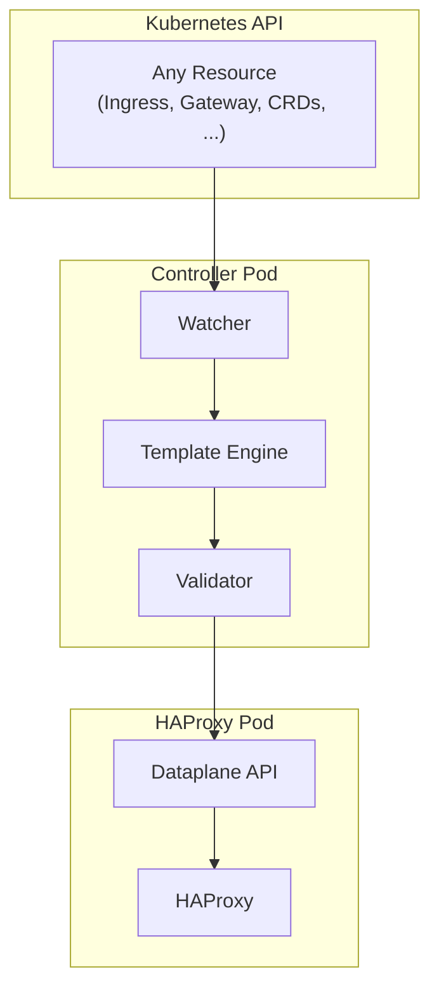

# HAPTIC

**HAPTIC** (HAProxy Template Ingress Controller) is a template-driven [HAProxy](https://www.haproxy.org/) Ingress Controller for Kubernetes that generates HAProxy configurations using [Scriggo](https://scriggo.com/) templates and deploys them via the [HAProxy Dataplane API](https://github.com/haproxytech/dataplaneapi).


!!! note "Community Project"
    This is an independent community project and is not affiliated with or endorsed by HAProxy Technologies.

## What is HAPTIC?

HAPTIC is an event-driven Kubernetes controller that:

- **Watches any Kubernetes resource** - Ingresses, Services, Secrets, Gateway API resources, or any custom resource type you configure
- **Renders Scriggo templates** - A fast, Go-native template engine
- **Validates before deployment** - Deploy with confidence knowing configurations are validated before they reach your load balancers
- **Deploys configurations** to HAProxy pods via the Dataplane API

Unlike traditional ingress controllers with hardcoded configuration logic, HAPTIC uses a template-driven approach that gives you full control over the generated HAProxy configuration. This means you can:

- **Define custom annotations** that your platform users can use, implemented with just a few lines of template code
- **Support new standards** like Gateway API without waiting for controller updates
- **Watch domain-specific CRDs** and generate HAProxy configuration from any Kubernetes resource type

## Key Features

### Template-Driven Flexibility

Traditional ingress controllers embed configuration logic in code. HAPTIC inverts this:

- **Full HAProxy access** - Write any HAProxy directive using the [configuration language](https://www.haproxy.com/documentation/haproxy-configuration-manual/latest/)
- **Add features without code changes** - New directives are template updates, not controller releases
- **Iterate rapidly** - Deploy configuration changes in minutes, not release cycles
- **Rich template context** - Access any Kubernetes resource, fetch external data via HTTP, and use controller state in your templates
- **Everything is templatable** - Generate not just `haproxy.cfg` but also map files, SSL certificates, CRT-lists, and custom auxiliary files

### Production Ready

- **High availability** - Leader election with automatic failover
- **Comprehensive validation** - Validating webhook, template validation, and CI/CD-runnable tests
- **Observability** - Prometheus metrics, structured logging, and debug endpoints
- **HTTP resource access** - Fetch external data for use in templates

!!! note "Helm Chart Features"
    The [Helm chart](/helm-chart/latest/) includes **Template Libraries** with support for Ingress and Gateway API and predefined annotations. You can use them, but you don't have to. You can start from scratch if you want.

## Architecture

The controller follows an event-driven architecture where changes to Kubernetes resources trigger a pipeline that renders templates, validates the output, and syncs configurations to HAProxy pods.



Key components:

- **Watcher** - Subscribes to Kubernetes API for configured resource types
- **Template Engine** - Renders Scriggo templates with resource data as context
- **Validator** - Validates generated HAProxy configuration before deployment
- **Dataplane Syncer** - Applies configuration changes to HAProxy pods via the Dataplane API

## Quick Start

For a complete walkthrough, see the [Getting Started](getting-started.md) guide which covers deploying HAProxy pods, installing the controller, and verifying your setup.

### Install with Helm

```bash
helm install my-controller oci://registry.gitlab.com/haproxy-haptic/haptic/charts/haptic --version 0.1.0-alpha.11
```

The Helm chart includes template libraries that support Kubernetes Ingress resources out of the box. See the [Helm Chart Documentation](/helm-chart/latest/) for configuration options.

### Verify Installation

Check the current rendered HAProxy configuration and deployment status:

```bash
kubectl describe haproxycfg
```

### Create an Ingress

With the default template libraries enabled, you can create an Ingress resource:

```yaml
apiVersion: networking.k8s.io/v1
kind: Ingress
metadata:
  name: example
spec:
  ingressClassName: haproxy
  rules:
    - host: example.com
      http:
        paths:
          - path: /
            pathType: Prefix
            backend:
              service:
                name: example-service
                port:
                  number: 80
```

### Extend with Custom Annotations

One of the key strengths of HAPTIC is how easily you can add custom behavior. For example, suppose your platform users need to inject a `X-Request-ID` header for distributed tracing. With traditional ingress controllers, you'd wait for a new release or fork the project. With HAPTIC, you add a template snippet to your Helm values:

```yaml
controller:
  config:
    templateSnippets:
      frontend-filters-request-id:
        template: |
          
          
          
          http-request set-header {{ header }} %[uuid()]
          
          
```

The snippet name `frontend-filters-request-id` follows a naming convention: snippets starting with `frontend-filters-` are automatically included in the HTTP frontend section where request/response modification happens. See the [Base Library Extension Points](/helm-chart/latest/libraries/base/#extension-points) for all available hooks.

Now users can enable request tracing by adding the annotation to the Ingress from the previous example:

```yaml
apiVersion: networking.k8s.io/v1
kind: Ingress
metadata:
  name: example
  annotations:
    example.com/request-id-header: "X-Request-ID"
spec:
  ingressClassName: haproxy
  rules:
    - host: example.com
      http:
        paths:
          - path: /
            pathType: Prefix
            backend:
              service:
                name: example-service
                port:
                  number: 80
```

This pattern works for any HAProxy feature - rate limiting, custom health checks, header manipulation, or anything else HAProxy supports.

The template system is fully hackable: you can override any template snippet, replace the main HAProxy template entirely, or disable all template libraries and start from scratch if you have a completely different vision for how your configuration should be rendered.

### Check the Result

View the generated HAProxy configuration:

```bash
kubectl describe haproxycfg
```

!!! note "Viewing YAML Output"
    Using `kubectl get haproxycfg -o yaml` doesn't display multiline configuration content well - literal `\n` characters appear instead of line breaks. Use `kubectl describe` for readable output.

## Further Reading

- [Getting Started](getting-started.md) - Deploy HAProxy pods, install the controller, and verify your setup
- [Templating](templating.md) - Learn the Scriggo template syntax and available context variables
- [Watching Resources](watching-resources.md) - Configure which Kubernetes resources the controller watches
- [Validation Tests](validation-tests.md) - Test your templates in CI/CD pipelines
- [Supported Configuration](supported-configuration.md) - Reference for all configuration options
- [Troubleshooting](troubleshooting.md) - Common issues and solutions
- [Helm Chart Documentation](/helm-chart/latest/) - Template libraries and chart configuration
