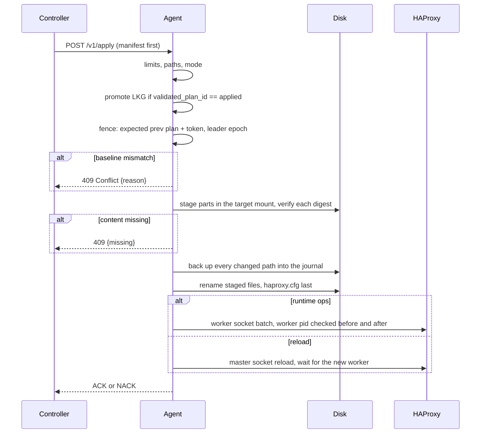
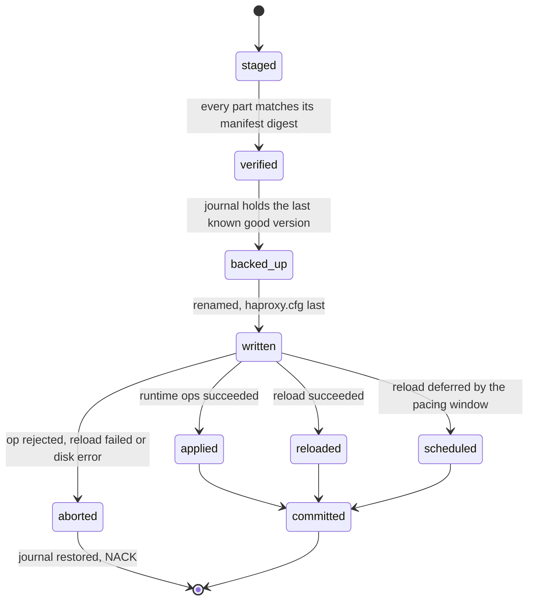

# The HAPTIC agent

The HAPTIC agent runs as the `agent` container of every HAProxy pod. It owns
that pod's file tree and its runtime socket: the controller sends it the
complete desired file set plus the typed runtime commands it composed for that
pod, and the agent writes the files in one transaction, runs the commands or
reloads, and reports what happened.

The agent makes no HAProxy decisions. An op kind it doesn't know, a baseline it
doesn't recognize, and a command HAProxy rejects all fall back to the same
thing: reload the file set that's on disk. That's why a classification bug
ships by rolling the controller, not the data plane.

The agent is the same binary as the controller: `haptic agent`.

Source: `pkg/dataplane/agent/{api,server,files,cli}`.

## Running it

```console
haptic agent \
  --base-dir /etc/haproxy \
  --config haproxy.cfg \
  --master-socket haproxy-master.sock \
  --worker-socket haproxy-worker.sock \
  --listen :5555 \
  --metrics-listen :9101 \
  --state-file .haptic-agent.json \
  --reload-interval-min 5s
```

Socket flags are relative to `--base-dir` unless you give an absolute path. The
credentials come from `DATAPLANE_USERNAME` and `DATAPLANE_PASSWORD`, which the
HAProxy pod already mounts from its credentials Secret. `LOG_LEVEL` sets the
log level; logs are JSON.

| Endpoint | Auth | Purpose |
|---|---|---|
| `GET /healthz` | none | The process is alive. |
| `GET /readyz` | none | Startup initialisation finished. |
| `GET /v1/state[?verify=1]` | basic | What this pod holds and runs. |
| `POST /v1/apply` | basic | Apply a desired state. |

`/readyz` turns true once the worker socket answers `show info`, the master
socket answers `show proc`, the tree is hashed against the state file, crash
recovery has run, and the runtime inventory is built. It stays true afterwards:
it means `this agent accepts applies`, never `the last apply succeeded`. A
readiness that tracked apply outcomes would drain the Service and fence the
repair path exactly when an operator needs it.

## Paths

One string names a file everywhere. HAProxy identifies maps and certificates by
the literal string in the configuration, and the chart writes those
base-relative, so `maps/host.map` is the manifest path, the op path, the runtime
identifier in `set map` and `show map`, and the entry in the inventory.
`--base-dir` is prefixed for disk access only and never appears in a runtime
command.

Paths must be relative and canonical, must stay under 255 bytes, and must have
no dot-prefixed component. The last rule keeps the agent's own state file, its
per-mount temp directories, and its backup directories outside every manifest.

## The apply

An apply is one multipart request: the `manifest` JSON part first, then one raw
part per file whose content the agent doesn't already hold, then an optional
opaque `plan` blob. The order is load-bearing, and so is the order in which the
agent processes it.



Nothing is written before the fence passes. The fence accepts an apply only when
`expected_prev_plan_id` and `expected_prev_token` equal what the agent has
applied and `token.leader_epoch` isn't older than the epoch it last accepted.
The three refusals are distinct because the controller's answers differ:

| `reason` | What happened | What the controller does |
|---|---|---|
| `prev_mismatch` | The pod is on a different plan than the ops assumed. | Re-diff from the returned state. |
| `stale_epoch` | A newer leader has already spoken to this pod. | Stand down until it re-acquires leadership. |
| `unknown_baseline` | The agent doesn't know what this pod runs. | Send full state with `mode: reload`. |

## The state machine

One apply is in flight at a time, and its phase is persisted before each step,
so a restart knows whether the tree can be a mix of two plans.



The reported mode is what actually happened: `runtime` (ops only, no reload),
`file_only` (files changed, no command needed), `reload`, `scheduled`, `noop`,
or `rejected`.

## The backup journal

Every apply records, per path it's about to change, how that path looked when
the last known good plan was current: `modified` keeps a hard link to the
file in the mount's `.haptic-lkg` directory, `created` writes a tombstone so a
rollback deletes the file, and `deleted` takes that link before it removes the
file. The first entry per
path wins, so a path changed three times since the last known good plan still
restores to the version that was good.

A completed reload clears the journal, because the pod's own HAProxy binary just
accepted that file set. A rollback clears it too, for the same reason in
reverse: the tree is the last known good set again.

A hard link can't cross a filesystem, and the HAProxy pod has more than one —
`general/` is its own `emptyDir`. At startup the agent probes the `st_dev` of
every directory under `--base-dir` and gives each mount its own temp and backup
directory. A rename that still crosses a device falls back to a copy and is
counted; the count must stay at zero.

## Disk is the authority

The state file carries no per-file digests. It carries one fold of the observed
tree, and at startup the agent re-hashes the ownership set and compares. A
mismatch means something else wrote the tree — most often the HAProxy container
restarting and copying the bootstrap configuration back — so the applied plan
becomes unknown and the next apply is full state plus a reload.

`GET /v1/state?verify=1` re-hashes on demand, which is what the controller's
drift prevention compares against. The plain `GET` returns the digests the agent
last observed.

## Runtime commands

Every runtime command goes to the worker stats socket in a single-runtime
session: `;`-joined lines, per-connection session state, `wait` with the
connection held open, and payload commands. The master socket carries only
`reload` and `show proc`.

Framing rules the agent enforces, all measured on HAProxy 3.0 and 3.4:

- A `;`-joined line stays under 12 KiB. The line buffer is all-or-nothing: over
  it, nothing at all is applied.
- A payload command is the last one on its line, and its payload is chunked
  under 12 KiB. Over the payload cap, zero entries land.
- Map values with spaces travel in the payload form. The line form of `add map`
  and `set map` stops at the first space, so a value with one is a truncation
  the operator never sees.
- Names, keys, paths, and keyword arguments pass a negative-space check first: no
  `;`, no whitespace, no `<<`, no backslash, no control characters. A value that
  fails is refused, never rewritten.
- `del map` removes one duplicate per call on 3.4 and all of them on 3.0, so the
  agent repeats it until HAProxy refuses.
- A versioned map replace is `prepare map`, chunked `add map @<version>`, then
  `commit map`. `clear map @<version>` isn't an abort — it clears on 3.0 and is
  a no-op on 3.4 — so a failed chunk leaks the version and is only counted.
- A failed certificate transaction is aborted. An open one wedges that
  certificate until the next reload.

Success is matched per command. `set severity-output number` makes HAProxy tag
its own messages, so a response tagged `[0]` to `[4]` is a failure; where the
success message is known (`New backend registered`, `New server registered.`,
`Backend published.`, `Server deleted.`, `Backend deleted.`, `Done.`) it must be
present. `name is already used by other proxy` and `Wait delay expired` become
typed outcomes: the first stops the apply and reloads, because nothing at
runtime reveals what shape the existing backend has.

Within one batched line, a failure is attributed to the earliest command that
could have produced it. That's a reporting limit, not a safety one: the answer
to any rejected op is to reload the desired set.

Deletes run off the apply path. The controller composes the whole A4 sequence;
the agent executes the traffic-stopping half immediately (`unpublish backend`,
`disable server`) and queues the removal half, which blocks on `wait`. The queue
caps at 1000 servers and 100 backends per pod; past that the apply reloads
instead of growing the queue.

## Pacing, rollback and the known-bad cache

`--reload-interval-min` is the shortest interval between two reloads. A reload
inside the window is scheduled, never dropped and never cancelled by a later
apply. While one is pending the files of a newer apply still land, its `ops` are
skipped, and its `in_place_ops` run against the running worker — guarded by
`expected_worker_ops_plan_id`, because those ops were composed against the
worker's state, not the file set's. A rejected in-place op invalidates the pod's
baseline and is reported; it never triggers a second reload.

A reload that answers `Success=0` restores the journal, reloads the restored set
when an op had already changed the running worker, and reports the failure with
HAProxy's own words. The recovery reload can itself fail — readiness stays true and the
failure becomes a condition and a metric, because a data plane that fences its
own repair path is worse than one running an unknown configuration.

Only HAProxy's own verdict on a set of bytes is remembered as known-bad, for 60
seconds. The key is the work the manifest asks for — its plan, mode, files, and
ops — not the exact request bytes, because the same rejected render comes back
with a different baseline attached. Input and output errors and timeouts are
never cached: they say nothing about the configuration.

## Invariants

The agent states its invariants as code. A violation increments
`haptic_agent_invariant_violations_total{name}` and logs at error level; it
never panics, because a data plane must not take itself down over an assertion.
The safety layer refuses or aborts the apply, and the decision layer degrades to
a reload.

| Name | What it asserts |
|---|---|
| `generation_monotonic` | A successful apply moves the generation by exactly one. |
| `disk_is_the_desired_set` | After a successful apply the tree is what the manifest declared. |
| `runtime_mode_does_not_reload` | A `runtime` outcome performed no reload. |
| `reload_mode_reloads` | A `reload` outcome performed or scheduled one. |
| `noop_runs_no_ops` | A `noop` outcome ran no commands. |
| `journal_only_while_diverged` | Backups exist only while the applied plan differs from the last known good one. |
| `mount_probe_found_every_mount` | No rename ever fell back to a cross-device copy. |
| `ops_executable` | Every op in a batch compiled to a command this agent knows. |

## Limits

Every loop the agent runs is bounded by one of these or by a counted collection.
They live in `pkg/dataplane/agent/api/limits.go` and are asserted at both ends.

| Limit | Value | Why |
|---|---|---|
| `MaxApplyBodyBytes` | 64 MiB | One apply request. |
| `MaxFiles` | 4096 | Files per manifest. |
| `MaxPlanBlobBytes` | 8 MiB | The opaque plan. |
| `MaxPathBytes` | 255 | One manifest path. |
| `MaxOpsPerApply` | 1000 | Ops per apply; the controller chunks beyond it. |
| `MaxCommandLineBytes` | 12 KiB | One `;`-joined line, under the 16 KiB buffer. |
| `MaxPayloadBytes` | 12 KiB | One payload command, under HAProxy 3.0's cap. |
| `MaxWaitBudgetMs` | 30000 | Total `wait …-removable` per apply. |
| `MaxReloadMs` | 60000 | One reload. |
| `MaxPendingServerDeletes` | 1000 | Queued server deletes per pod. |
| `MaxPendingBackendDeletes` | 100 | Queued backend deletes per pod. |
| `MaxMapDelRepeat` | 64 | `del map` calls for one key. |

## Metrics

The agent exports its own metrics on `--metrics-listen`.

| Metric | Labels | Meaning |
|---|---|---|
| `haptic_agent_apply_total` | `mode` | Applies completed, by outcome. |
| `haptic_agent_apply_rejected_total` | `stage` | Applies refused or rolled back. |
| `haptic_agent_invariant_violations_total` | `name` | Invariants that failed. |
| `haptic_agent_reloads_total` | `result` | Reloads asked of the master process. |
| `haptic_agent_rollbacks_total` | — | File sets restored to the last known good one. |
| `haptic_agent_deferred_deletes_total` | `kind`, `outcome` | Deferred runtime deletes. |
| `haptic_agent_op_errors_total` | `kind` | Ops HAProxy rejected. |
| `haptic_agent_generation` | — | The apply generation. |
| `haptic_runtime_map_divergence_total` | — | Read-backs that found the worker out of step. |
