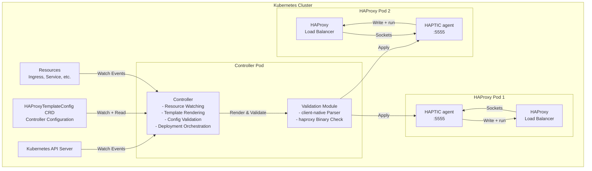
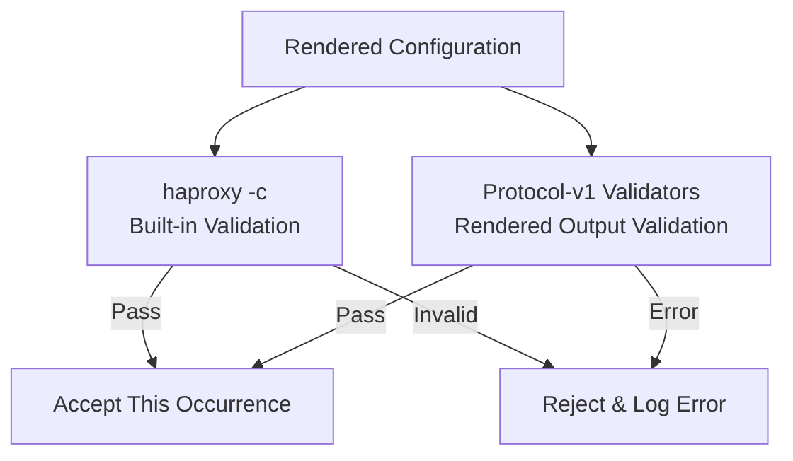

# Architecture overview

This page maps the controller's runtime components and how a Kubernetes change flows through rendering, validation, and deployment. For what HAPTIC is and why, see the [design landing page](../design.md).

**Operational Model:**

The controller operates through event-driven coordination, with one synchronous service inside the leader: rendering and validation *aren't* a multi-hop event chain, they're a single Pipeline call.

1. **Resource Watchers** (`pkg/k8s/watcher`, all-replica) monitor Kubernetes resources and publish `ResourceIndexUpdatedEvent` / `IndexSynchronizedEvent` to EventBus
2. **Reconciler** (`pkg/controller/reconciler.Reconciler`, all-replica) subscribes to those events and publishes `ReconciliationTriggeredEvent` immediately on every one — no reconciler-level debounce (also fires immediately on `BecameLeaderEvent` to bootstrap the new leader). Coalescing of bursts is done upstream in the per-watcher debounce window; reload throttling is done downstream in the deployer.
3. **Coordinator** (`pkg/controller/reconciler.Coordinator`, **leader-only**) subscribes to `ReconciliationTriggeredEvent`, calls `Pipeline.Execute` synchronously — no event hop. It pins `currentFiles` to the leader term and advances it synchronously when a render succeeds, before publishing result events. Its pipeline is render plus any pluggable output validators; HAProxy's own verdict runs off this path in the render gate (ADR-0022). The Coordinator publishes `TemplateRenderedEvent` for downstream observers, and finally `ReconciliationCompletedEvent` (or `ReconciliationFailedEvent`) for metrics/commentator.
4. **DeploymentScheduler** (`pkg/controller/deployer.DeploymentScheduler`, **leader-only**) subscribes to `TemplateRenderedEvent` plus `HAProxyPodsDiscoveredEvent`, enforces rate limiting (`minDeploymentInterval`), implements latest-wins coalescing, and publishes `DeploymentScheduledEvent`
5. **RenderGate** (`pkg/controller/rendergate.Component`, **leader-only**) runs `haproxy -c -dr` on the newest render concurrently with the fan-out, on a semaphore slot of its own, and publishes `RenderGateCompletedEvent`. A pass names the plan every agent may promote its rollback baseline to; a refusal reverts the pods that took the plan without loading it and holds every later render until one passes
6. **Deployer** (`pkg/controller/deployer.Component`, **leader-only**) subscribes to `DeploymentScheduledEvent`, diffs the render against each pod's baseline, applies the result to every HAProxy endpoint in parallel, logs successful endpoints directly, and publishes `DeploymentCompletedEvent` plus per-endpoint `InstanceDeploymentFailedEvent`
7. **All-replica observers** (Discovery, StatusApplier, ProposalValidator, HTTPStore, Metrics, Commentator) react locally to the events they consume; where a write is leader-only, the leader-only sister component picks up the work

There is no event-adapter for rendering: the leader's synchronous `pkg/controller/pipeline.Pipeline` runs `RenderService` from the Coordinator's call stack. HAProxy's own check on a reconcile render is a component, because it deliberately stays off that call stack.

**Key Design Principles:**

- **Fail-Safe**: Invalid configurations are rejected before reaching production
- **Performance**: Debouncing prevents rapid successive renders, indexing enables fast lookups
- **Observability**: Prometheus metrics, structured logging, and a `/debug/vars` introspection endpoint
- **Flexibility**: Templates provide complete control over HAProxy configuration, no annotation limitations

## Component diagrams

### High-level system components

**Component Descriptions:**

- **Controller**: Main controller process that watches Kubernetes resources, renders templates, and orchestrates configuration deployment
- **Validation Module**: Integrated validation using haproxytech/client-native library for parsing and haproxy binary for configuration checks
- **HAPTIC agent**: the container in every HAProxy pod that owns the pod's file tree and its runtime sockets. It writes what the controller sends and runs the commands it's given; it makes no HAProxy decisions of its own
- **HAProxy**: The load balancer instances the controller configures — the deployment targets for every rendered config

### Controller Internal Architecture

The dashed arrows between Coordinator and the synchronous pipeline are direct function calls — there is no event hop for rendering. This synchronous render design is recorded as an Architecture Decision Record (ADR); see [Design Decisions](design-decisions.md#event-driven-architecture) for the rationale. The Coordinator publishes `TemplateRenderedEvent` itself once the synchronous call returns.

**Event-Driven Data Flow:**

1. **Config/Resource Watchers** receive Kubernetes changes, coalesce bursts within a per-resource debounce window (default `100ms`, overridable via `spec.watchedResources.<name>.debounceInterval`; the bundled chart sets `"0"` on EndpointSlice), and publish one event per quiet window to the EventBus. This is the only debounce layer.
2. **Reconciler** subscribes to change events, filters initial sync events, and publishes `ReconciliationTriggeredEvent` immediately on every change — there is no second reconciler-level debounce or refractory window. Also fires on `BecameLeaderEvent` so a freshly elected leader produces a current render instead of waiting for the next change.
3. **Coordinator** (leader-only) subscribes to `ReconciliationTriggeredEvent` and calls `pkg/controller/pipeline.Pipeline.Execute(ctx, storeProvider)` synchronously. The pipeline runs `RenderService.Render` plus any pluggable output validators in one atomic step. On success, the Coordinator publishes `TemplateRenderedEvent`; on failure, `ReconciliationFailedEvent` carrying a `*PipelineError` (use `errors.AsType[*PipelineError]` to extract the failed phase, as the Coordinator does in `handlePipelineFailure`). Either path ends with `ReconciliationCompletedEvent` for metrics.
4. **DeploymentScheduler** (leader-only) subscribes to `TemplateRenderedEvent`, `RenderGateCompletedEvent`, `HAProxyPodsDiscoveredEvent`, and `ConfigValidatedEvent`; enforces rate limiting (default `2s` minimum interval), implements "latest wins" queueing, publishes `DeploymentScheduledEvent`
5. **RenderGate** (leader-only) subscribes to `TemplateRenderedEvent`, runs `haproxy -c -dr` off the reconcile path and publishes `RenderGateCompletedEvent`; a refusal reverts the pods carrying the plan and holds later renders
6. **Deployer** (leader-only) subscribes to `DeploymentScheduledEvent`, applies the render to all HAProxy endpoints in parallel, logs successful endpoints directly, and publishes `InstanceDeploymentFailedEvent` per failed endpoint and `DeploymentCompletedEvent` overall
7. **Discovery** (all-replica) probes HAProxy pods, caches `HAProxyPodsDiscoveredEvent` via `leadership.StateReplayer` so the next leader gets current state on `BecameLeaderEvent`
8. **ConfigPublisher** (leader-only) subscribes to `TemplateRenderedEvent` + `RenderGateCompletedEvent`, writes the rendered config + auxiliary files as observable CRDs (`HAProxyCfg`, `HAProxyMapFile`, …) and records the gate's verdict on the `HAProxyCfg` as the `ConfigValidated` / `ConfigPinned` conditions
9. **Support Components** (Metrics, Commentator, StatusApplier) subscribe to relevant events for metrics / logs / status patches

**Key Architecture Properties:**

- **EventBus** is the single coordination mechanism - zero direct component-to-component function calls
- **Event-Driven Components** (Reconciler, Coordinator, Scheduler, Deployer, ConfigPublisher, Discovery, …) wrap pure libraries (`pkg/templating`, `pkg/dataplane`, `pkg/k8s`) in event adapters; rendering remains a synchronous pipeline service, while `RenderGate` and strict proposal pipelines call the synchronous HAProxy-validation service (see [Design Decisions](design-decisions.md#event-driven-architecture))
- **Pure Libraries** (`pkg/templating`, `pkg/dataplane`, `pkg/k8s`) contain testable business logic with no event dependencies
- **Event Adapters** translate between EventBus pub/sub and pure library function calls
- **Extensibility** - new features can subscribe to existing events without modifying existing code
- **Independent testing** - unit-test pure libraries with no event infrastructure; exercise event adapters in integration tests

### Validation flow

**Validation Strategy:**

Production validation delegates the complete verdict to `haproxy -c -f config`.
Each call creates a temp directory mirroring the production layout (`maps/`,
`ssl/`, `general/`), writes the auxiliary files there, and rewrites
`default-path origin <baseDir>` to that directory. A context-aware gate bounds
binary concurrency; cancellation removes a queued check or terminates its
process. The pure-Go syntax and schema check remains only in the browser
playground, which has no HAProxy binary.

Built-in HAProxy validation and every matching protocol-v1 rendered-output
validator execute on every occurrence, including exact repeats. The checksum
identifies output but doesn't identify the executable or runtime environment
that judges it. Future reuse requires an authenticated hermetic-environment
root covering the executable, configuration, dependencies, and runtime
generation, bound to the exact input. [ADR-0020](../adr/0020-authoritative-render-validation-pipeline.md)
records why validation is attached to output rather than assumed from its
trigger.

## Operating assumptions and constraints

### Triggers

Two mechanisms trigger reconciliation:

- **Watched resource changes** — the primary trigger; debounced to coalesce bursts.
- **Drift prevention** — a periodic check (default `60s`, set via `spec.dataplane.driftPreventionInterval`) that asks every pod to re-hash its tree and re-applies if a digest disagrees with the render. This catches out-of-band changes to HAProxy and keeps desired and actual configuration eventually consistent.

### Constraints

- Any directive HAProxy accepts can be deployed: the rendered bytes reach the pod unchanged, and the pod's own binary is what judges them. What the render declares about its own structure decides whether a change can avoid a reload — see [Supported Configuration](../../supported-configuration.md).
- The controller assumes HAProxy runs alongside a HAPTIC agent reachable on the pod network (default port `5555`). Every apply goes through that agent; there is no SSH or kubectl-exec path into HAProxy.

### System environment

- The controller runs as a Kubernetes container.
- Each managed HAProxy instance must be a Kubernetes Pod with an agent container sharing the HAProxy config volume.
- The controller's ServiceAccount needs `get`/`list`/`watch` on every resource type listed in `spec.watchedResources`, plus the standard set granted by the chart (Pods, Services, EndpointSlices, the CRDs, and `coordination.k8s.io/leases` for leader election). See [Security — RBAC](../../operations/security.md#rbac).
