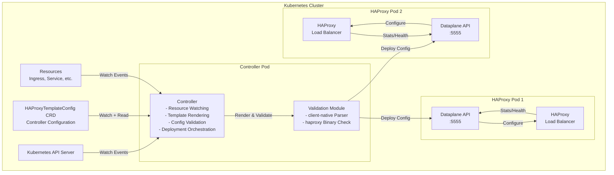
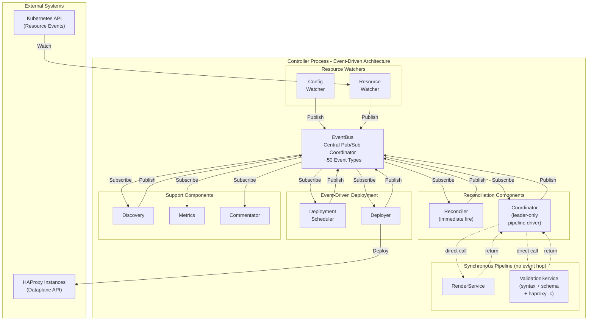
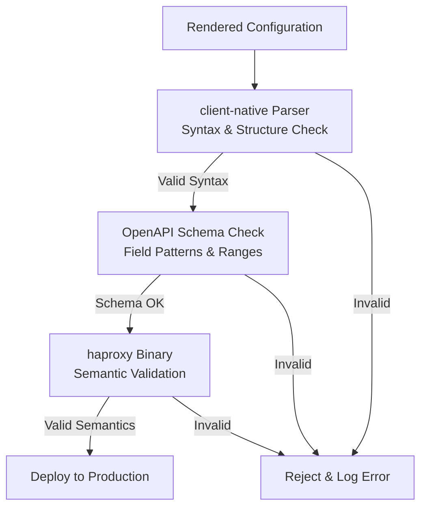

# Architecture overview

This page maps the controller's runtime components and how a Kubernetes change flows through rendering, validation, and deployment. For what HAPTIC is and why, see the [design landing page](../design.md).

**Operational Model:**

The controller operates through event-driven coordination, with one synchronous service inside the leader: rendering and validation *aren't* a multi-hop event chain, they're a single Pipeline call.

1. **Resource Watchers** (`pkg/k8s/watcher`, all-replica) monitor Kubernetes resources and publish `ResourceIndexUpdatedEvent` / `IndexSynchronizedEvent` to EventBus
2. **Reconciler** (`pkg/controller/reconciler.Reconciler`, all-replica) subscribes to those events and publishes `ReconciliationTriggeredEvent` immediately on every one — no reconciler-level debounce (also fires immediately on `BecameLeaderEvent` to bootstrap the new leader). Coalescing of bursts is done upstream in the per-watcher debounce window; reload throttling is done downstream in the deployer.
3. **Coordinator** (`pkg/controller/reconciler.Coordinator`, **leader-only**) subscribes to `ReconciliationTriggeredEvent`, calls `Pipeline.Execute` synchronously — no event hop. It holds two pipelines. The **first** render of each iteration takes the strict one (full `haproxy -c`); an iteration restarts on every config change, so a config or template change is always checked semantically. Every render after that takes the fast one (client-native parser syntax + OpenAPI schema, `SkipSemanticValidation: true`) — watched-resource changes already passed `haproxy -c` at admission, and the Dataplane API re-validates server-side on push. The Coordinator then publishes `TemplateRenderedEvent` + `ValidationCompletedEvent` for downstream observers, and finally `ReconciliationCompletedEvent` (or `ReconciliationFailedEvent`) for metrics/commentator.
4. **DeploymentScheduler** (`pkg/controller/deployer.DeploymentScheduler`, **leader-only**) subscribes to those events plus `HAProxyPodsDiscoveredEvent`, enforces rate limiting (`minDeploymentInterval`), implements latest-wins coalescing, and publishes `DeploymentScheduledEvent`
5. **Deployer** (`pkg/controller/deployer.Component`, **leader-only**) subscribes to `DeploymentScheduledEvent`, executes parallel `dataplane.Sync` calls against every HAProxy endpoint, logs successful endpoints directly, and publishes `DeploymentCompletedEvent` plus per-endpoint `InstanceDeploymentFailedEvent`
6. **All-replica observers** (Discovery, StatusApplier, ProposalValidator, HTTPStore, Metrics, Commentator) react locally to the events they consume; where a write is leader-only, the leader-only sister component picks up the work

There is no event-adapter for rendering or HAProxy-config validation in production: the leader's synchronous `pkg/controller/pipeline.Pipeline` runs `RenderService` + a `ValidationService` in one shot, with no event hop between them.

**Key Design Principles:**

- **Fail-Safe**: Invalid configurations are rejected before reaching production
- **Performance**: Debouncing prevents rapid successive renders, indexing enables fast lookups
- **Observability**: Prometheus metrics, structured logging, and a `/debug/vars` introspection endpoint
- **Flexibility**: Templates provide complete control over HAProxy configuration, no annotation limitations

## Component diagrams

### High-level system components

**Component Descriptions:**

- **Controller**: Main controller process that watches Kubernetes resources, renders templates, and orchestrates configuration deployment
- **Validation Module**: Integrated validation using haproxytech/client-native library for parsing and haproxy binary for configuration checks
- **Dataplane API**: HAProxy's management interface for receiving configuration updates and performing runtime operations
- **HAProxy**: The load balancer instances the controller configures — the deployment targets for every rendered config

### Controller Internal Architecture

The dashed arrows between Coordinator and the synchronous pipeline are direct function calls — there is no event hop for rendering or HAProxy validation. This synchronous render-validate design is recorded as an Architecture Decision Record (ADR); see [Design Decisions](design-decisions.md#event-driven-architecture) for the rationale. The Coordinator publishes `TemplateRenderedEvent` and `ValidationCompletedEvent` itself once the synchronous call returns.

**Event-Driven Data Flow:**

1. **Config/Resource Watchers** receive Kubernetes changes, coalesce bursts within a per-resource debounce window (default `2s`, overridable via `spec.watchedResources.<name>.debounceInterval`; the bundled chart sets `"0"` on EndpointSlice), and publish one event per quiet window to the EventBus. This is the only debounce layer.
2. **Reconciler** subscribes to change events, filters initial sync events, and publishes `ReconciliationTriggeredEvent` immediately on every change — there is no second reconciler-level debounce or refractory window. Also fires on `BecameLeaderEvent` so a freshly elected leader produces a current render instead of waiting for the next change.
3. **Coordinator** (leader-only) subscribes to `ReconciliationTriggeredEvent` and calls `pkg/controller/pipeline.Pipeline.Execute(ctx, storeProvider)` synchronously. The pipeline runs `RenderService.Render` + the fast `ValidationService.Validate` (syntax + schema) in one atomic step. On success, the Coordinator publishes `TemplateRenderedEvent` + `ValidationCompletedEvent`; on failure, `ReconciliationFailedEvent` carrying a `*PipelineError` (use `errors.AsType[*PipelineError]` to extract the failed phase, as the Coordinator does in `handlePipelineFailure`). Either path ends with `ReconciliationCompletedEvent` for metrics.
4. **DeploymentScheduler** (leader-only) subscribes to `TemplateRenderedEvent`, `ValidationCompletedEvent`, `HAProxyPodsDiscoveredEvent`, and `ConfigValidatedEvent`; enforces rate limiting (default `2s` minimum interval), implements "latest wins" queueing, publishes `DeploymentScheduledEvent`
5. **Deployer** (leader-only) subscribes to `DeploymentScheduledEvent`, executes parallel `dataplane.Sync` calls to all HAProxy endpoints, logs successful endpoints directly, and publishes `InstanceDeploymentFailedEvent` per failed endpoint and `DeploymentCompletedEvent` overall
6. **Discovery** (all-replica) probes HAProxy pods, caches `HAProxyPodsDiscoveredEvent` via `leadership.StateReplayer` so the next leader gets current state on `BecameLeaderEvent`
7. **ConfigPublisher** (leader-only) subscribes to `TemplateRenderedEvent` + `ValidationCompletedEvent`, writes the rendered config + auxiliary files as observable CRDs (`HAProxyCfg`, `HAProxyMapFile`, …)
8. **Support Components** (Metrics, Commentator, StatusApplier) subscribe to relevant events for metrics / logs / status patches

**Key Architecture Properties:**

- **EventBus** is the single coordination mechanism - zero direct component-to-component function calls
- **Event-Driven Components** (Reconciler, Coordinator, Scheduler, Deployer, ConfigPublisher, Discovery, …) wrap pure libraries (`pkg/templating`, `pkg/dataplane`, `pkg/k8s`) in event adapters; the rendering and HAProxy-validation services they call are themselves *not* event-adapter components — they're synchronous services driven from inside Coordinator's `Pipeline.Execute` (see [Design Decisions](design-decisions.md#event-driven-architecture))
- **Pure Libraries** (`pkg/templating`, `pkg/dataplane`, `pkg/k8s`) contain testable business logic with no event dependencies
- **Event Adapters** translate between EventBus pub/sub and pure library function calls
- **Extensibility** - new features can subscribe to existing events without modifying existing code
- **Independent testing** - unit-test pure libraries with no event infrastructure; exercise event adapters in integration tests

### Validation flow

**Validation Strategy:**

Three phases run in-process, eliminating the need for a separate validation sidecar container:

1. **Phase 1 — Syntax parsing.** client-native parses the configuration and validates it against the HAProxy config grammar.
2. **Phase 1.5 — OpenAPI schema check.** The parsed structure is cross-checked against the version-specific DataPlane API OpenAPI spec — catches out-of-range values, pattern violations, and missing required fields before they reach HAProxy.
3. **Phase 2 — Semantic validation.** `haproxy -c -f config` performs full semantic validation including resource availability. Each call creates a per-process temp directory mirroring the production layout (`maps/`, `ssl/`, `general/`), writes the auxiliary files there, and rewrites the rendered config's `default-path origin <baseDir>` line to point at the temp dir — so file references resolve exactly like at runtime. File I/O is fully isolated per call, but the actual `haproxy -c` invocation is still serialised by a global `haproxyCheckMutex` (`pkg/dataplane/validate_haproxy.go`) because concurrent binary invocations have been observed to interfere with each other.

Results are cached by an SHA-256 over (config + auxiliary files) per instance — repeat validations during drift-prevention cycles short-circuit before touching disk. Because Phase 2 runs the real `haproxy` binary against a mirror of the production file layout, a passing check means a live HAProxy instance would accept the config.

Two service instances are wired (`buildValidationPipelines` in `pkg/controller/reconciliation.go`): the **strict** one (all three phases) serves the watched-resource admission webhook, HTTP-store promotion, *and* the Coordinator's first render of each iteration — an iteration restarts on every config change, so a config or template change is always checked semantically. Every render after that falls through to the **fast** instance (`SkipSemanticValidation: true`), which runs only Phases 1 and 1.5: its inputs already passed the strict check, and the Dataplane API runs its own `haproxy -c` server-side before accepting a push.

## Operating assumptions and constraints

### Triggers

Two mechanisms trigger reconciliation:

- **Watched resource changes** — the primary trigger; debounced to coalesce bursts.
- **Drift prevention** — a periodic check (default `60s`, set via `spec.dataplane.driftPreventionInterval`) that re-deploys if any rendered file differs from what was last pushed. This catches out-of-band changes to HAProxy and keeps desired and actual configuration eventually consistent.

### Constraints

- The Dataplane API doesn't cover every directive in the [HAProxy configuration language](https://www.haproxy.com/documentation/haproxy-configuration-manual/latest/). HAPTIC can only deploy configurations that the underlying [`haproxytech/client-native`](https://github.com/haproxytech/client-native) parser accepts. See [Supported Configuration](../../supported-configuration.md) for the current coverage.
- The controller assumes HAProxy runs alongside a Dataplane API instance reachable on the pod network (default port `5555`). Validation and deployment go through that API; there is no SSH or kubectl-exec path into HAProxy.

### System environment

- The controller runs as a Kubernetes container.
- Each managed HAProxy instance must be a Kubernetes Pod with a Dataplane API sidecar sharing the HAProxy config volume.
- The controller's ServiceAccount needs `get`/`list`/`watch` on every resource type listed in `spec.watchedResources`, plus the standard set granted by the chart (Pods, Services, EndpointSlices, the CRDs, and `coordination.k8s.io/leases` for leader election). See [Security — RBAC](../../operations/security.md#rbac).
