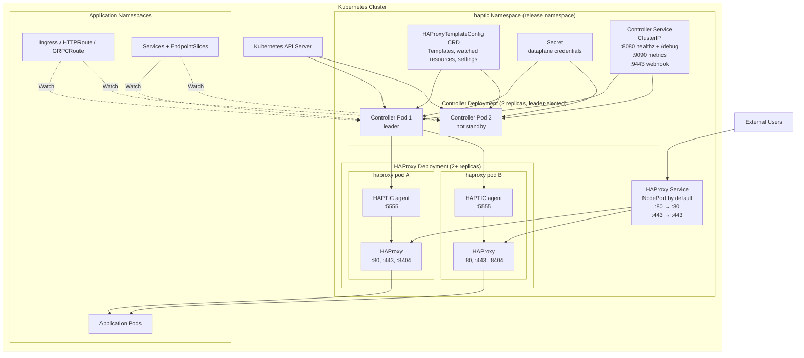
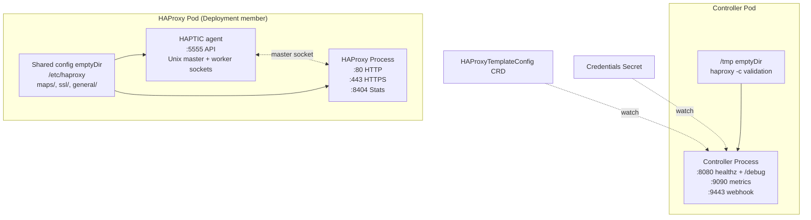
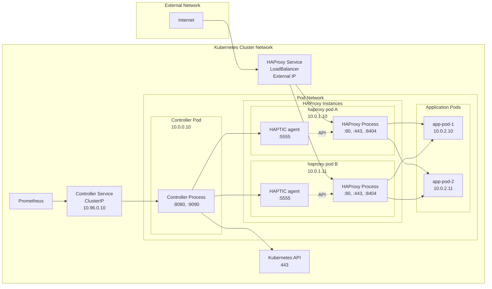
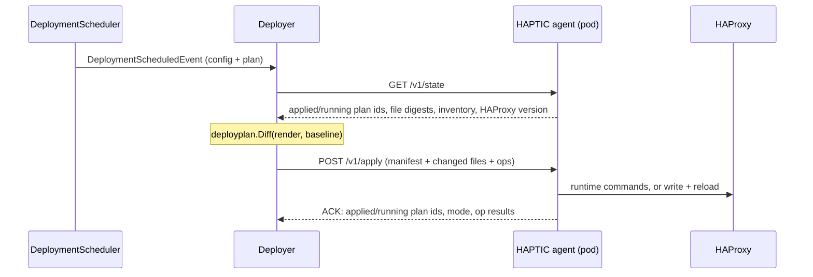

# Deployment diagrams

## Kubernetes Deployment Architecture



**Deployment Components:**

1. **Controller Deployment** — defaults to 2 replicas with leader election
    - All replicas watch Kubernetes resources, run admission webhooks, and discover HAProxy pods (hot standby — keeps caches warm so failover is instant)
    - Only the elected leader runs the render-validate Pipeline and applies configuration through each pod's HAPTIC agent
    - See [High Availability](../../operations/high-availability.md) for tuning failover and [Leader Election](./leader-election.md) for the full all-replica vs leader-only component split

2. **Controller Service** (ClusterIP) — operational endpoints only
    - `:8080` → healthz probes and `/debug/*` introspection
    - `:9090` → Prometheus metrics
    - `:9443` → validating webhook

3. **HAProxy Deployment** (not StatefulSet) — scales horizontally
    - Each pod runs HAProxy plus the HAPTIC agent, which owns the config volume and HAProxy's runtime socket
    - Pods are auto-discovered via `controller.config.podSelector`; a pod is admitted once it has an IP, its `agent` container is running, and its `GET /v1/state` answers

4. **HAProxy Service** — NodePort by default; set `haproxy.service.type: LoadBalancer` for cloud providers
    - Service port 80 maps to HAProxy container port 80, service port 443 maps to 443 (the chart binds HAProxy on the literal 80/443; set `haproxy.ports.http`/`https` to override)

5. **HAProxyTemplateConfig CRD** — holds every piece of configuration the controller needs
    - Template bodies (`haproxyConfig`, `templateSnippets`, `maps`, `files`, `sslCertificates`)
    - `watchedResources` (what to subscribe to and how to index it)
    - Apply tuning (`minDeploymentInterval`, `driftPreventionInterval`, `syncTimeout`, storage paths)
    - Validation tests shipped alongside the templates

6. **Credentials Secret** referenced by `spec.credentialsSecretRef` — holds the agent's basic-auth username and password. Watched live, so rotations don't require a restart.

## Container Architecture



**Resource Requirements**: chart defaults, the sizing table, and the GOMAXPROCS/GOMEMLIMIT container-awareness mechanics live in [Performance — Controller Resource Sizing](../../operations/performance.md#controller-resource-sizing). Diagram-relevant specifics: the controller writes transient `haproxy -c` validation files to a `/tmp` emptyDir (root filesystem is read-only), and both HAProxy-pod containers share the config `emptyDir` mounted at `/etc/haproxy`.

## Network topology



**Network Flow:**

1. **Ingress Traffic**: Internet → HAProxy Service → HAProxy Pods → Application Pods (the diagram shows the `haproxy.service.type: LoadBalancer` variant; the chart default is NodePort)
2. **Control Plane**: Controller → Kubernetes API (resource watching)
3. **Configuration Deployment**: Controller → each pod's agent (HTTP `POST /v1/apply`)
4. **Service Discovery**: Controller watches HAProxy pods via Kubernetes API
5. **Monitoring**: Prometheus → Controller Service (ClusterIP) → Controller Pod (metrics endpoint)
6. **Health Checks**: Kubernetes → Controller Service → Controller Pod (healthz endpoint)

**Scaling Considerations**: HAProxy scales horizontally via `haproxy.replicaCount` (pods are auto-discovered through `controller.config.podSelector`); the controller scales for availability, not throughput — see [Performance — Scaling Strategies](../../operations/performance.md#scaling-strategies) and [High Availability](../../operations/high-availability.md). NetworkPolicy must allow the controller to reach the agent port 5555 on each HAProxy pod ([Networking](../../operations/networking.md)).

## How one deployment reaches a pod

The controller never pushes a configuration and diffs it back. Each render
produces an immutable plan (`pkg/dataplane/renderplan`) describing the sections,
the backend records and the file set it emitted; the deploy side compares that
plan with what each pod reports and sends the difference.



**Per pod, per deployment:**

1. `GET /v1/state` reports the plan the pod applied, the plan its worker runs,
   the digest of every file it holds, its runtime inventory and its HAProxy
   version. The drift pass asks for `?verify=1`, which re-hashes the tree, so a
   file changed behind the controller's back shows up as a digest difference.
2. The baseline is that applied plan. The controller keeps the plans the fleet
   still refers to; on a miss it decodes the opaque blob the pod stored, which
   is what makes a leader change cost no reload. A blob it cannot vouch for —
   foreign schema version, wrong plan id — is no baseline at all.
3. `deployplan.Diff` compares the render with the baseline and answers
   `runtime`, `file_only` or `reload`, with the reasons for each change it could
   not take at runtime. Pods reporting the same baseline share one answer.
4. The manifest carries the complete desired file set at digest granularity and
   a part only for a file the agent does not already hold; `haproxy.cfg` always
   travels whole. Ops beyond `api.MaxOpsPerApply` are split into chunks, each
   fenced on what the previous chunk applied.
5. The ACK reports what the pod applied and what it runs. Both land in
   `HAProxyCfg.status.deployedToPods[]`, together with the mode and the reasons.

At most 16 pods are applied to concurrently, each bounded by `syncTimeout`.

**Fencing.** Every apply carries a token: the leader epoch — a counter on the
leader Lease that each leadership term claims before it dispatches — and a
per-term apply sequence. The agent accepts an apply only when the baseline it
names is the one the pod has and the epoch is not older than the one it last
accepted. The three refusals:

| 409 reason | What it means | What the controller does |
|---|---|---|
| `prev_mismatch` | the pod's applied plan moved | re-read its state and diff again, once |
| `unknown_baseline` | the pod dropped its baseline | send the complete file set with `mode: reload` |
| `stale_epoch` | a newer leader owns the fleet | stand down; losing the epoch race is losing leadership |

A `409` listing missing file parts is answered by resending exactly those files.

**Refusals.** An apply the agent judged and refused (a NACK) counts
`haptic_apply_rejected_total{pod}`, reports HAProxy's own words through the
pod's status, and drops that pod's baseline so its next apply is the complete
state plus a reload. An agent speaking a different API major, or missing an op
kind the controller composes, gets the same treatment plus
`haptic_agent_version_skew_total` — never a refusal, because a fleet-correlated
refusal would fence the repair path.

**Convergence.** A deployment's `Succeeded` count is the pods *running* the
render: `applied_plan_id == desired`, the apply was accepted, and no reload is
pending. A pod whose paced reload is still scheduled has the files on disk but
does not serve them, so it is neither converged nor a failure.

**Pacing.** Reload pacing belongs to the agent (`--reload-interval-min`), which
coalesces reloads without holding back applies that need none. The scheduler
keeps one deployment in flight at a time and a single latest-wins pending slot,
so a burst of renders collapses into one follow-up deployment.

## Build optimizations (contributors)

Controller images are built with Go's Profile-Guided Optimization (PGO), which typically provides 2-7% CPU improvement by optimizing frequently called functions. A baseline CPU profile (`cmd/haptic/default.pgo`) is committed to the repository; Go automatically uses it during builds to optimize hot paths.

**Updating the profile** from the development environment:

1. Start the dev environment:

    ```bash
    ./scripts/start-dev-env.sh
    ```

2. Port-forward to the controller's debug port:

    ```bash
    kubectl -n haptic port-forward deploy/haptic-controller 8080:8080
    ```

3. Generate workload (trigger reconciliation by modifying resources).

4. Collect a 30-second CPU profile:

    ```bash
    make pgo-profile
    # Or manually:
    curl -o cmd/haptic/default.pgo http://localhost:8080/debug/pprof/profile?seconds=30
    ```

5. Rebuild with the new profile:

    ```bash
    make build
    ```

For optimal results, collect profiles from production during representative workloads and merge multiple profiles for broader coverage:

```bash
make pgo-merge PROFILES='profile1.pgo profile2.pgo'
```
