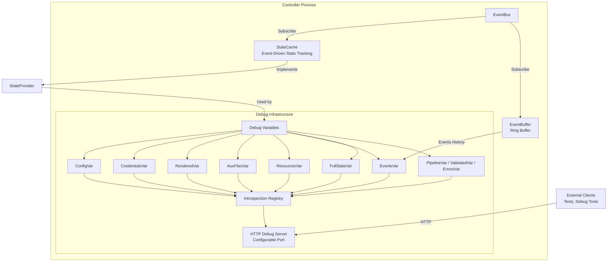

# Runtime introspection and debugging

The controller exposes its live state — config, rendered output, resources, events — over an HTTP debug server, so you can debug production issues and drive acceptance tests without parsing logs.

## Architecture overview



## Key components

**pkg/introspection** - Generic debug HTTP server infrastructure:

- Instance-based variable registry (not global like expvar)
- HTTP handlers for `/debug/vars` endpoints
- JSONPath field selection support (kubectl-style syntax)
- Go profiling integration (`/debug/pprof`)
- Graceful shutdown with context

**pkg/events/ringbuffer** - Event history storage:

- Thread-safe circular buffer using Go generics
- Fixed-size with automatic old-item eviction
- O(1) add, O(n) retrieval performance
- Used by both EventCommentator and EventBuffer

**pkg/controller/debug** - Controller-specific debug variables:

- Registers variables through `RegisterVariables` (`pkg/controller/debug/setup.go`) as `introspection.Func` closures over the `StateProvider` — there are no per-variable struct types
- Core state vars: `config`, `credentials` (metadata only), `rendered`, `auxfiles`, `resources`
- Pipeline status vars (used by acceptance tests): `pipeline`, `validated`, `errors`
- `events` (an `EventsVar` over the buffer) and `state`, the catch-all `/debug/vars/state` payload
- `EventBuffer` for independent event tracking
- `StateProvider` interface for accessing controller state without coupling to specific event types

**StateCache** - Event-driven state tracking:

- Subscribes to validation, rendering, and resource events
- Maintains current state snapshot in memory
- Thread-safe RWMutex-protected access
- Implements StateProvider interface for debug endpoints
- Prevents need to query EventBus for historical state

## HTTP endpoints

The debug server exposes controller state via HTTP. The port comes from the `--debug-port` flag or the `DEBUG_PORT` environment variable (the Helm chart derives that environment variable, the container port, Service, probes, and NetworkPolicy from `controller.ports.healthz`, defaulting to `8080`; `/healthz` shares the same required listener). The endpoint reference — every `/debug/vars/*` path, JSONPath field selection, `/debug/events` correlation-ID search, and `pprof` usage — lives in the [Debugging Guide](../../operations/debugging.md).

## Event history

Two independent event tracking mechanisms:

**EventCommentator** (observability):

- Subscribes to all events for domain-aware logging
- Ring buffer for event correlation in log messages
- Produces rich contextual log output
- Lives in pkg/controller/commentator

**EventBuffer** (debugging):

- Subscribes to all events for debug endpoint access
- Simplified event representation for HTTP API
- Exposes last N events via `/debug/vars/events`
- Lives in pkg/controller/debug

This separation allows different buffer sizes, retention policies, and use cases without coupling logging to debugging infrastructure.

## Integration with acceptance testing

Acceptance tests drive the controller and assert on its state through these endpoints. `tests/acceptance/debug_client.go` provides a `*DebugClient` that port-forwards into ready controller pods and rotates across them, because `/debug/*` is loopback-only — a request arriving through the API server's service-proxy comes from the pod network and would be rejected with 403:

```go
import "gitlab.com/haproxy-haptic/haptic/tests/acceptance"

// Most tests use the helper that waits for the pod and the debug service
// endpoints before constructing the client (handles pod restarts cleanly).
debugClient, err := acceptance.EnsureDebugClientReady(
    ctx, t, client, clientset, namespace, 30*time.Second,
)
require.NoError(t, err)

// Patch the HAProxyTemplateConfig CRD via the dynamic client (real tests
// use the t.Update / t.Patch helpers from sigs.k8s.io/e2e-framework).
patchHAProxyTemplateConfig(ctx, /* ... */)

// Wait for the controller to roll over to the new spec.
err = debugClient.WaitForConfigVersion(ctx, "<new resourceVersion>", 30*time.Second)
require.NoError(t, err)

// Inspect the rendered config (with retry while the new revision propagates).
rendered, err := debugClient.GetRenderedConfigWithRetry(ctx, 30*time.Second)
require.NoError(t, err)
assert.Contains(t, rendered, "expected-content")
```

`DebugClient` also exposes `GetConfig`, `GetPipelineStatus`, `GetErrors`, and `GetAuxiliaryFiles`. To inspect the recent-events buffer, fetch the `/debug/vars/events` endpoint directly (there is no typed `GetEvents` helper).

If you need to construct the client yourself (typically only inside `EnsureDebugClientReady`), the constructor takes the `*rest.Config`, the clientset, the namespace, and the port, and returns `(*DebugClient, error)` — no service name, since pods are selected internally by label:

```go
client, err := acceptance.NewDebugClient(restConfig, clientset, namespace, acceptance.DebugPort)
```

Tests observe controller state directly — no log parsing, no timing heuristics.

## Security and Configuration

Two design constraints matter here; everything operational about them lives elsewhere:

- **Debug variables never expose secret material.** Credential variables return metadata only (`version`, `has_dataplane_creds`) — `pkg/controller/debug/setup.go` enforces this. Access control and NetworkPolicy examples: [Security — Network Exposure](../../operations/security.md#network-exposure).
- **The server binds `0.0.0.0:<port>` deliberately**, so kubelet health probes can reach `/healthz` on the pod IP — but every `/debug/*` route is wrapped in `requireLoopback` (`pkg/introspection/http.go`) and answers 403 to anything that didn't arrive over loopback. Reach the diagnostics with `kubectl port-forward`, and restrict `pods/portforward` with RBAC. Port configuration and the shared `/healthz` listener: [Debugging — Accessing the Server](../../operations/debugging.md#accessing-the-server).

For detailed implementation and API documentation, see:

- `pkg/introspection/README.md` - Generic debug HTTP server
- `pkg/events/ringbuffer/README.md` - Ring buffer implementation
- `pkg/controller/debug/README.md` - Controller-specific debug variables
