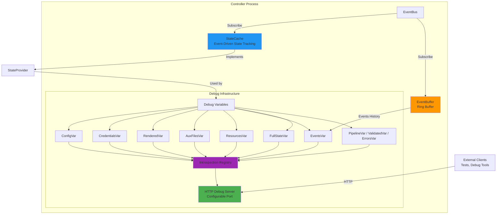

# Runtime Introspection and Debugging

The controller provides comprehensive runtime introspection capabilities through an HTTP debug server, enabling production debugging, operational visibility, and acceptance testing without relying solely on logs.

## Architecture Overview



## Key Components

**pkg/introspection** - Generic debug HTTP server infrastructure:

- Instance-based variable registry (not global like expvar)
- HTTP handlers for `/debug/vars` endpoints
- JSONPath field selection support (kubectl-style syntax)
- Go profiling integration (`/debug/pprof`)
- Graceful shutdown with context

**pkg/events/ringbuffer** - Event history storage:

- Thread-safe circular buffer using Go generics
- Fixed-size with automatic old-item eviction
- O(1) add, O(n) retrieval performance
- Used by both EventCommentator and EventBuffer

**pkg/controller/debug** - Controller-specific debug variables:

- Implements `introspection.Var` interface for controller data
- Core state vars: `ConfigVar`, `CredentialsVar` (metadata only), `RenderedVar`, `AuxFilesVar`, `ResourcesVar`
- Pipeline status vars (used by acceptance tests): `PipelineVar`, `ValidatedVar`, `ErrorsVar`
- `EventsVar` for the event-buffer view, `FullStateVar` for the catch-all `/debug/vars/state` payload
- `EventBuffer` for independent event tracking
- `StateProvider` interface for accessing controller state without coupling to specific event types

**StateCache** - Event-driven state tracking:

- Subscribes to validation, rendering, and resource events
- Maintains current state snapshot in memory
- Thread-safe RWMutex-protected access
- Implements StateProvider interface for debug endpoints
- Prevents need to query EventBus for historical state

## HTTP Endpoints

The debug server exposes controller state via HTTP. The port comes from the `--debug-port` flag or the `DEBUG_PORT` environment variable (the Helm chart sets both via the `controller.debugPort` value, defaulting to `8080`). `/healthz` shares the same listener — see [Configuration](#configuration) for why setting the port to `0` breaks Kubernetes probes.

```bash
# List all available variables
curl http://localhost:8080/debug/vars

# Get current configuration
curl http://localhost:8080/debug/vars/config

# Get just the config version using JSONPath
curl 'http://localhost:8080/debug/vars/config?field={.version}'

# Get rendered HAProxy configuration
curl http://localhost:8080/debug/vars/rendered

# Get resource counts
curl http://localhost:8080/debug/vars/resources

# Get the most recent 100 events (the defaultLimit baked into EventsVar)
curl http://localhost:8080/debug/vars/events

# Tune the count or search by correlation ID via the separate /debug/events endpoint
curl 'http://localhost:8080/debug/events?limit=500'
curl 'http://localhost:8080/debug/events?correlation_id=<id>'

# Get complete state dump
curl http://localhost:8080/debug/vars/state

# Go profiling
curl http://localhost:8080/debug/pprof/
curl http://localhost:8080/debug/pprof/heap
curl http://localhost:8080/debug/pprof/goroutine
```

## Event History

Two independent event tracking mechanisms:

**EventCommentator** (observability):

- Subscribes to all events for domain-aware logging
- Ring buffer for event correlation in log messages
- Produces rich contextual log output
- Lives in pkg/controller/commentator

**EventBuffer** (debugging):

- Subscribes to all events for debug endpoint access
- Simplified event representation for HTTP API
- Exposes last N events via `/debug/vars/events`
- Lives in pkg/controller/debug

This separation allows different buffer sizes, retention policies, and use cases without coupling logging to debugging infrastructure.

## Integration with Acceptance Testing

The debug endpoints enable powerful acceptance testing. `tests/acceptance/debug_client.go` provides a `*DebugClient` that talks to the controller via the Kubernetes API server's service-proxy, so tests don't need to manage `kubectl port-forward` themselves:

```go
import "gitlab.com/haproxy-haptic/haptic/tests/acceptance"

// Most tests use the helper that waits for the pod and the debug service
// endpoints before constructing the client (handles pod restarts cleanly).
debugClient, err := acceptance.EnsureDebugClientReady(
    ctx, t, client, clientset, namespace, 30*time.Second,
)
require.NoError(t, err)

// Patch the HAProxyTemplateConfig CRD via the dynamic client (real tests
// use the t.Update / t.Patch helpers from sigs.k8s.io/e2e-framework).
patchHAProxyTemplateConfig(ctx, /* ... */)

// Wait for the controller to roll over to the new spec.
err = debugClient.WaitForConfigVersion(ctx, "<new resourceVersion>", 30*time.Second)
require.NoError(t, err)

// Inspect the rendered config (with retry while the new revision propagates).
rendered, err := debugClient.GetRenderedConfigWithRetry(ctx, 30*time.Second)
require.NoError(t, err)
assert.Contains(t, rendered, "expected-content")
```

`DebugClient` also exposes `GetConfig`, `GetPipelineStatus`, `GetErrors`, and `GetAuxiliaryFiles`. To inspect the recent-events buffer, fetch the `/debug/vars/events` endpoint directly (there is no typed `GetEvents` helper).

If you need to construct the client yourself (typically only inside `EnsureDebugClientReady`), the constructor takes the clientset, the namespace, the *service* name (not a pod name), and the port:

```go
client := acceptance.NewDebugClient(clientset, namespace, serviceName, acceptance.DebugPort)
```

This enables true end-to-end testing without parsing logs or relying on timing heuristics.

## Security Considerations

Debug variables implement careful filtering:

```go
// CredentialsVar returns metadata only
func (v *CredentialsVar) Get() (any, error) {
    creds, version, err := v.provider.GetCredentials()
    if err != nil {
        return nil, err
    }

    return map[string]any{
        "version":             version,
        "has_dataplane_creds": creds.DataplanePassword != "",
        // NEVER expose actual passwords
    }, nil
}
```

The debug server should be:

- Accessible on all interfaces (0.0.0.0); restrict access via NetworkPolicy rather than relying on bind-address filtering
- Protected by network policies
- Disabled or restricted in multi-tenant environments

## Configuration

The debug server is configured by the controller binary at startup, not via the `HAProxyTemplateConfig` CRD:

| Setting | Source | Notes |
|---------|--------|-------|
| Port | `--debug-port` flag, `DEBUG_PORT` env, or Helm `controller.debugPort` value | Default `0` = disabled; the chart sets it to `8080` by default |
| Bind address | Hardcoded `0.0.0.0:<port>` | So kubelet health probes and the Kubernetes API service-proxy (used by acceptance tests) can reach it on the pod IP; `kubectl port-forward` works regardless |
| Event-buffer size | Compile-time constant (`pkg/controller/debug`) | Not tunable per-deployment |
| Go profiling | Always mounted at `/debug/pprof/*` when the debug port is enabled | See [Debugging Guide](../../operations/debugging.md#go-profiling) |

Setting `controller.debugPort: 0` disables the introspection server entirely. `/healthz` lives on the same listener, so disabling it also drops health-check responses and breaks the Kubernetes liveness/readiness probes — restrict `/debug/*` via NetworkPolicy instead (see [Security — Network Exposure](../../operations/security.md#network-exposure)).

For detailed implementation and API documentation, see:

- `pkg/introspection/README.md` - Generic debug HTTP server
- `pkg/events/ringbuffer/README.md` - Ring buffer implementation
- `pkg/controller/debug/README.md` - Controller-specific debug variables
