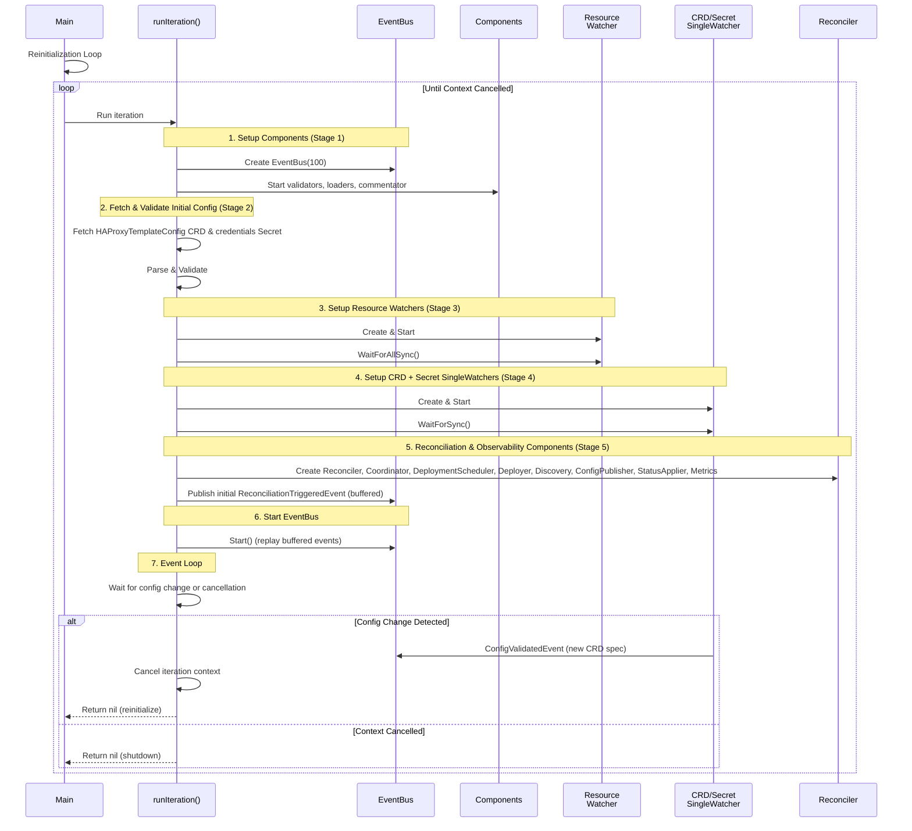
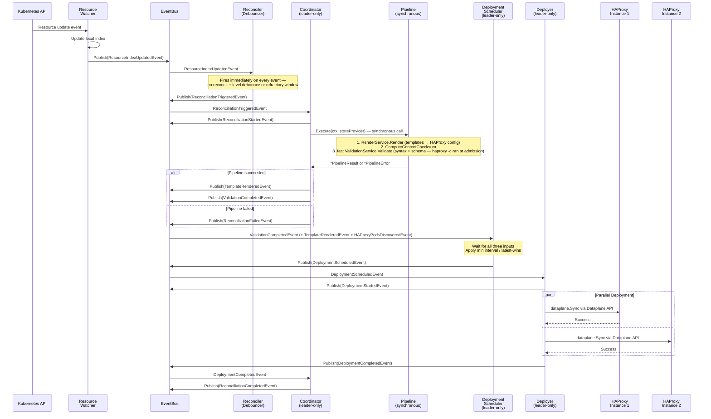
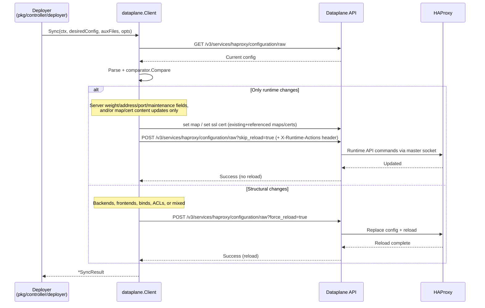

# Sequence diagrams

## Startup and Initialization

The controller uses a **reinitialization loop** pattern where it responds to configuration changes by restarting with the new configuration. Each iteration follows these initialization steps:



**Reinitialization Loop Pattern:**

The controller runs iterations that respond to configuration changes:

1. **Component Setup (Stage 1)**: Create the EventBus and the config-management components (validators, loaders, commentator), plus the early infrastructure servers, so health and debug endpoints respond before the config is loaded.
2. **Initial Config Fetch (Stage 2)**: Fetch and validate the `HAProxyTemplateConfig` CRD named by `--crd-name` (env `CRD_NAME`, default `haproxy-config`) and the credentials `Secret` referenced via `spec.credentialsSecretRef`, synchronously.
3. **Resource Watchers (Stage 3)**: Create bulk watchers for every `spec.watchedResources` entry and wait for initial sync.
4. **Config/Secret SingleWatchers (Stage 4)**: Create `pkg/k8s/watcher.SingleWatcher`s for the CRD and credentials Secret. These use immediate callbacks (no debouncing) so configuration updates reinitialize with no artificial delay.
5. **Reconciliation & Observability (Stage 5)**: Create reconciliation components (Reconciler, Coordinator, DeploymentScheduler, Deployer, Discovery, ConfigPublisher, StatusApplier, DriftPreventionMonitor) and observability components (Metrics, Debug HTTP server). Each subscribes in its constructor, and the initial trigger events are published — buffered — before the bus starts. Rendering and full HAProxy validation run synchronously inside `Pipeline.Execute` from the Coordinator's call stack ([Architecture Decision Record (ADR) 0001](../adr/0001-renderer-is-synchronous-not-event-adapter.md)) — neither has its own goroutine or event subscription. The config validators (Basic, Template, JSONPath) are Stage 1 scatter-gather participants over `ConfigValidationRequest`, not Stage 5 components.
6. **EventBus Start**: Call `EventBus.Start()` to replay the buffered events and begin normal operation.
7. **Leader Election, Webhook, Debug (Stages 6–8)**: Start leader election (Stage 6), the admission webhook when a TLS cert directory is mounted (Stage 7), and register debug variables and the full health checker (Stage 8).
8. **Event Loop**: Wait for configuration changes or context cancellation.
9. **Reinitialization**: When the CRD or Secret changes, cancel the iteration context to stop all components, then restart with the new settings.

The stage numbers are the code's startup log labels (`Stage 1: Creating config management components` through `Stage 8: Registering debug variables and updating health checker` — see `pkg/controller/iteration.go` and its callees). `EventBus.Start()` carries no stage label of its own; it runs between Stages 5 and 6, after every component has subscribed.

## Resource change handling



**Event-Driven Flow:**

1. **Resource Change**: ResourceWatcher receives Kubernetes events, updates the local index, and coalesces bursts within a per-resource debounce window before publishing one `ResourceIndexUpdatedEvent` per quiet window. The window defaults to 2 s (`pkg/k8s/types.DefaultDebounceInterval`); each watched resource can override it via `spec.watchedResources.<name>.debounceInterval` (the bundled chart sets `"0"` on EndpointSlice). This is the only debounce layer.
2. **Reconciliation Trigger**: Reconciler publishes `ReconciliationTriggeredEvent` immediately on every event it receives — there is no second reconciler-level refractory window. Whole-store events (`IndexSynchronizedEvent`, `BecameLeaderEvent`, `DriftPreventionTriggeredEvent`) trigger the same way; only the initial-sync variant of `ResourceIndexUpdatedEvent` is filtered out. Reload throttling happens downstream in the deployer's `minDeploymentInterval`.
3. **Coordinator (leader-only)**: subscribes to `ReconciliationTriggeredEvent`, publishes `ReconciliationStartedEvent`, then calls `pkg/controller/pipeline.Pipeline.Execute(ctx, storeProvider)` **synchronously** — render and validation are one atomic step, not a multi-hop event chain.
4. **Pipeline**: runs `RenderService.Render` (template engine + auxiliary files), computes the content checksum once, then runs the fast `ValidationService.Validate` (syntax via client-native parser → OpenAPI schema; the leader pipeline skips the `haproxy -c` phase — the strict service runs it at admission and on HTTP-store promotion).
5. **Coordinator post-pipeline**: on success, publishes `TemplateRenderedEvent` + `ValidationCompletedEvent` for downstream consumers; on failure, publishes `ReconciliationFailedEvent` carrying a `*PipelineError` (use `errors.AsType[*PipelineError]` to extract the failed phase).
6. **DeploymentScheduler (leader-only)**: subscribes to `TemplateRenderedEvent`, `ValidationCompletedEvent`, and `HAProxyPodsDiscoveredEvent`; only deploys when all three inputs are present. Enforces `minDeploymentInterval` and "latest wins" coalescing.
7. **Deployer (leader-only)**: executes parallel `dataplane.Sync` calls to every endpoint, logs successful endpoints directly, and publishes per-endpoint `InstanceDeploymentFailedEvent` plus aggregate `DeploymentCompletedEvent`.
8. **Completion**: Coordinator subscribes to `DeploymentCompletedEvent` and publishes `ReconciliationCompletedEvent` with duration metrics.

There is no event-adapter for rendering or HAProxy-config validation — the synchronous Pipeline owns both. Coordination still happens entirely via EventBus pub/sub *between* components; only the render-validate split inside the Coordinator is a direct function call.

## Configuration validation process

This is the inside view of step 4 in the previous diagram — `Pipeline.Execute` runs `ValidationService.Validate` after rendering, all inside the leader-only Coordinator's call stack:

```mermaid
sequenceDiagram
    participant Coord as Coordinator<br/>(leader-only)
    participant Pipeline
    participant Render as RenderService
    participant Validate as ValidationService
    participant Parser as client-native Parser
    participant Schema as OpenAPI Schema
    participant Binary as haproxy Binary

    Coord->>Pipeline: Execute(ctx, storeProvider)
    Pipeline->>Render: Render(ctx, storeProvider)
    Render-->>Pipeline: *RenderResult (config + aux files)

    Pipeline->>Pipeline: ComputeContentChecksum(config, aux)
    Pipeline->>Validate: ValidateWithChecksum(ctx, config, aux, checksum)
    Note over Validate: Per-instance cache (cacheMu, RWMutex)<br/>checksum hit → return cached parsed config

    Validate->>Validate: os.MkdirTemp("", "haproxy-validation-*")
    Note over Validate: Per-call sandbox — every Validate gets<br/>its own unique /tmp dir. File I/O is per-call;<br/>a cancellable gate serialises haproxy -c

    Validate->>Parser: validateSyntax(config)
    alt Syntax error
        Parser-->>Validate: error
        Validate-->>Pipeline: ValidationResult{Valid:false, Phase:"syntax"}
    else
        Parser-->>Validate: *parser.StructuredConfig
        Validate->>Schema: validateAPISchema(parsed, version)
        alt Schema error
            Schema-->>Validate: error
            Validate-->>Pipeline: ValidationResult{Valid:false, Phase:"schema"}
        else
            Schema-->>Validate: ok
            Note over Validate: Every changed render runs semantic validation;<br/>identical content returns from the cache above
            Validate->>Binary: haproxy -c -f /tmp/<unique>/haproxy.cfg
            alt Semantic error
                Binary-->>Validate: exit 1 + stderr
                Validate-->>Pipeline: ValidationResult{Valid:false, Phase:"semantic"}
            else
                Binary-->>Validate: exit 0
                Validate->>Validate: cacheResult(checksum, parsedConfig)
                Validate-->>Pipeline: ValidationResult{Valid:true, ParsedConfig:...}
            end
        end
    end

    Pipeline-->>Coord: *PipelineResult or *PipelineError
```

**Validation Steps:**

1. **Pipeline call**: `Coordinator.handleReconciliationTriggered` calls `Pipeline.Execute` synchronously. The pipeline first renders, then validates — both in the same call stack, no event hop.
2. **Cache check**: `ValidationService` keys its per-instance cache on a SHA-256 of `(config + aux files)` (`pkg/dataplane.ComputeContentChecksum`). Identical content during drift-prevention cycles returns the cached `*parser.StructuredConfig` without running any phase. Failures are *not* cached — every failure retries.
3. **Sandbox**: each `Validate` call creates its own `os.MkdirTemp("", "haproxy-validation-*")` and rewrites the rendered config's `default-path origin` to point at it. File I/O is fully isolated per call. A context-aware gate serialises `haproxy -c`; cancellation removes queued checks or terminates the running process. A per-instance `cacheMu` (`sync.RWMutex`) guards the cached `*parser.StructuredConfig` lookup.
4. **Phase 1 — Syntax**: client-native parser checks grammar and section structure. Cheap.
5. **Phase 1.5 — OpenAPI schema**: parsed structure cross-checked against the version-specific Dataplane API OpenAPI spec via `pkg/generated/validators`. Catches out-of-range values, pattern violations, missing required fields. Also cheap (in-memory, no fork).
6. **Phase 2 — Semantic**: writes the config + auxiliary files into a per-call temp directory, runs `haproxy -c -f <tempdir>/haproxy.cfg`, parses the binary's stderr on failure. The temp directory mirrors the production layout (`maps/`, `ssl/`, `general/`) under `default-path origin <tempdir>` so file references resolve exactly like at runtime.
7. **Rendered-output validators**: after the built-in phases pass, the pipeline sends the complete rendered file set to each configured pluggable validator. An error becomes phase `external`; warnings remain attached to the successful result.
8. **Result**: Pipeline wraps the result into a `*PipelineResult` (success) or `*PipelineError` (failure carrying `Phase` for `errors.AsType[*PipelineError]`); the Coordinator then publishes `ValidationCompletedEvent` or `ReconciliationFailedEvent` accordingly.

## Zero-reload deployment strategy



**Deployment Optimization:**

`pkg/dataplane.Client.Sync` analyses configuration changes to determine the optimal deployment strategy:

1. **Runtime-Only Updates**: Server weight/address/port/maintenance changes, and/or content updates to an existing, already-referenced map (`set map`, v3.0+) or certificate (`set ssl cert`, v3.2+), are applied to the live worker via the Runtime API, then a single `skip_reload` raw push carries the `X-Runtime-Actions` server fields → no reload
2. **Mixed Updates**: Apply runtime-eligible server changes via the Runtime API first, then ship the rendered config in one `force_reload` raw push → single reload
3. **Structural Updates**: Backend/frontend/bind/ACL changes, map/cert **create or delete**, and other auxiliary-file changes (general, CA, crt-list) → one `force_reload` raw config push → reload required

The controller maintains its own `serverRuntimeSupportedJSONFields` table in `pkg/dataplane/comparator/sections/factory_server.go`, mirroring the Dataplane API's `RuntimeSupportedFields["server"]`. The comparator uses this table to classify each server-field change as runtime-eligible (no reload) or structural (reload required).
