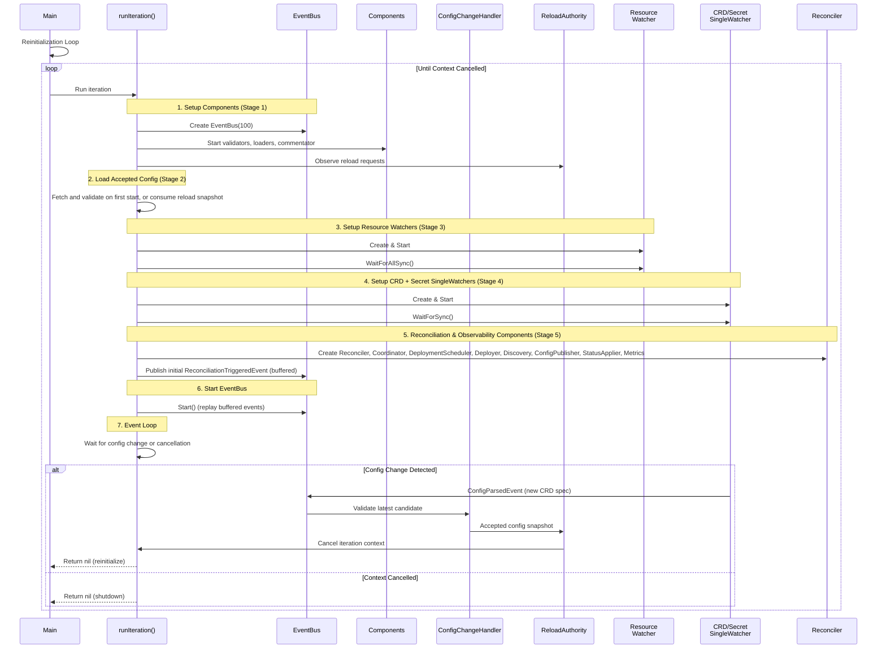
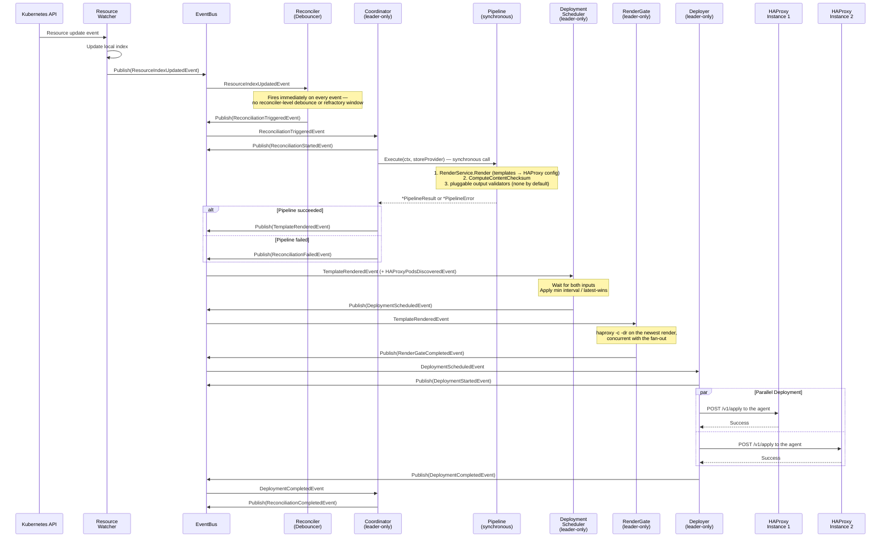
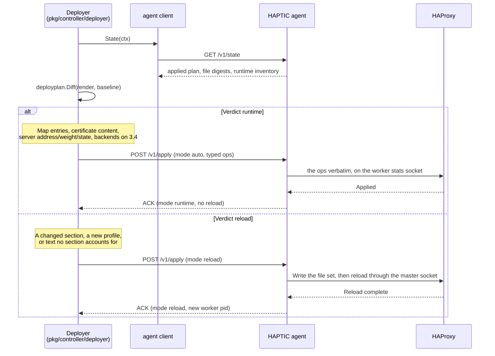

# Sequence diagrams

## Startup and Initialization

The controller uses a **reinitialization loop** pattern where it responds to configuration changes by restarting with the new configuration. Each iteration follows these initialization steps:



**Reinitialization Loop Pattern:**

The controller runs iterations that respond to configuration changes:

1. **Component Setup (Stage 1)**: Create the EventBus and the config-management components (validators, loaders, commentator), plus the early infrastructure servers, so health and debug endpoints respond before the config is loaded.
2. **Config load (Stage 2)**: On first start, fetch and validate the `HAProxyTemplateConfig` and credentials `Secret`. The immediate iteration after a live change consumes the exact accepted raw/effective config, discovery resolution, sources, and credentials from the previous iteration; it doesn't fetch a newer candidate. The handoff is single-use, so a failed replacement attempt fetches live state on retry. Fresh loads and schema re-resolutions run Basic, Template, JSONPath, and `validationTests` before activation.
3. **Resource Watchers (Stage 3)**: Create bulk watchers for every `spec.watchedResources` entry and wait for initial sync.
4. **Config/Secret SingleWatchers (Stage 4)**: Create `pkg/k8s/watcher.SingleWatcher`s for the CRD and credentials Secret. These use immediate callbacks (no debouncing) so configuration updates reinitialize with no artificial delay.
5. **Reconciliation & Observability (Stage 5)**: Create reconciliation components (Reconciler, Coordinator, DeploymentScheduler, Deployer, Discovery, ConfigPublisher, StatusApplier, DriftPreventionMonitor) and observability components (Metrics, Debug HTTP server). Each subscribes in its constructor, and the initial trigger events are published — buffered — before the bus starts. Rendering and full HAProxy validation run synchronously inside `Pipeline.Execute` from the Coordinator's call stack ([Architecture Decision Record (ADR) 0001](../adr/0001-renderer-is-synchronous-not-event-adapter.md)) — neither has its own goroutine or event subscription. The config validators (Basic, Template, JSONPath, and `validationTests`) are Stage 1 scatter-gather participants over `ConfigValidationRequest`, not Stage 5 components.
6. **EventBus Start**: Call `EventBus.Start()` to replay the buffered events and begin normal operation.
7. **Leader Election, Webhook, Debug (Stages 6–8)**: Start leader election (Stage 6), the admission webhook when a TLS cert directory is mounted (Stage 7), and register debug variables and the full health checker (Stage 8).
8. **Reload authority**: Observe the config-change channel from the beginning of the iteration. An accepted request cancels startup sync waits as well as the steady-state event loop.
9. **Reinitialization**: The active snapshot and latest accepted candidate remain distinct. A newer parsed config retires the older candidate's reload reason and restores active state consumers; credential and schema reasons remain pending. A served-CRD change re-resolves the authoritative raw config before rebuilding, and the replacement CRD watch compares discovery once after sync to cover changes made during handoff.

The stage numbers are the code's startup log labels (`Stage 1: Creating config management components` through `Stage 8: Registering debug variables and updating health checker` — see `pkg/controller/iteration.go` and its callees). `EventBus.Start()` carries no stage label of its own; it runs between Stages 5 and 6, after every component has subscribed.

## Resource change handling



**Event-Driven Flow:**

1. **Resource Change**: ResourceWatcher receives Kubernetes events, updates the local index, and coalesces bursts within a per-resource debounce window before publishing one `ResourceIndexUpdatedEvent` per quiet window. The window defaults to 100 ms (`pkg/k8s/types.DefaultDebounceInterval`); each watched resource can override it via `spec.watchedResources.<name>.debounceInterval` (the bundled chart sets `"0"` on EndpointSlice). This is the only debounce layer.
2. **Reconciliation Trigger**: Reconciler publishes `ReconciliationTriggeredEvent` immediately on every event it receives — there is no second reconciler-level refractory window. Whole-store events (`IndexSynchronizedEvent`, `BecameLeaderEvent`, `DriftPreventionTriggeredEvent`) trigger the same way; only the initial-sync variant of `ResourceIndexUpdatedEvent` is filtered out. Reload throttling happens downstream in the deployer's `minDeploymentInterval`.
3. **Coordinator (leader-only)**: subscribes to `ReconciliationTriggeredEvent`, publishes `ReconciliationStartedEvent`, then calls `pkg/controller/pipeline.Pipeline.Execute(ctx, storeProvider)` **synchronously** — render and validation are one atomic step, not a multi-hop event chain.
4. **Pipeline**: runs `RenderService.Render` (template engine + auxiliary files), computes the content checksum once, then runs any pluggable output validators (an operator opt-in; none by default). The reconcile instance has no `ValidationService` at all — HAProxy's verdict is the render gate's job, off this path (ADR-0022).
5. **Coordinator post-pipeline**: on success, publishes `TemplateRenderedEvent` for downstream consumers; on failure, publishes `ReconciliationFailedEvent` carrying a `*PipelineError` (use `errors.AsType[*PipelineError]` to extract the failed phase).
6. **DeploymentScheduler (leader-only)**: subscribes to `TemplateRenderedEvent` and `HAProxyPodsDiscoveredEvent`; deploys when both are present. Enforces `minDeploymentInterval` and "latest wins" coalescing. `RenderGateCompletedEvent` moves the gate's latch: a refusal holds every later render, and the pass that names the held one releases it.
6a. **RenderGate (leader-only)**: runs `haproxy -c -dr` on the newest render, on a semaphore slot of its own, and publishes `RenderGateCompletedEvent`. A refusal reverts the pods that took the plan without loading it, and the deployer names each passing plan on its next apply so the agents may promote their rollback baseline.
7. **Deployer (leader-only)**: diffs the render against each pod's baseline, applies the result to every endpoint in parallel, logs successful endpoints directly, and publishes per-endpoint `InstanceDeploymentFailedEvent` plus aggregate `DeploymentCompletedEvent`.
8. **Completion**: Coordinator subscribes to `DeploymentCompletedEvent` and publishes `ReconciliationCompletedEvent` with duration metrics.

There is no event-adapter for rendering or HAProxy-config validation — the synchronous Pipeline owns both. Coordination still happens entirely via EventBus pub/sub *between* components; only the render-validate split inside the Coordinator is a direct function call.

## Configuration validation process

This is the strict proposal and load-gate path. Reconciliation runs the same
HAProxy check asynchronously in `RenderGate`, after its render pipeline runs
the configured rendered-output validators.

```mermaid
sequenceDiagram
    participant Caller
    participant Pipeline
    participant Render as RenderService
    participant Validate as ValidationService
    participant Binary as haproxy Binary
    participant External as Protocol-v1 Validators

    Caller->>Pipeline: Execute(ctx, storeProvider)
    Pipeline->>Render: Render(ctx, storeProvider)
    Render-->>Pipeline: authenticated output snapshot

    Pipeline->>Pipeline: retain authenticated content checksum
    Pipeline->>Validate: ValidateOutputSnapshotWithChecksum(ctx, output, checksum)
    Validate->>Validate: authenticate and materialize exact output

    Validate->>Validate: os.MkdirTemp("", "haproxy-validation-*")
    Note over Validate: Every occurrence gets a new sandbox;<br/>the checksum never bypasses the binary
    Validate->>Binary: haproxy -c -f /tmp/<unique>/haproxy.cfg
    alt HAProxy refuses the output
        Binary-->>Validate: exit 1 + stderr
        Validate-->>Pipeline: ValidationResult{Valid:false, Phase:"semantic"}
    else
        Binary-->>Validate: exit 0
        Validate-->>Pipeline: ValidationResult{Valid:true}
        Pipeline->>External: ValidateRenderedOutput(ctx, exact files)
        Note over External: Every matching v1 validator receives<br/>every request, including exact repeats
        External-->>Pipeline: warnings or error
    end

    Pipeline-->>Caller: *PipelineResult or *PipelineError
```

**Validation Steps:**

1. **Render**: the pipeline produces one authenticated immutable output snapshot.
2. **Identity**: the content checksum travels with that output for publishing and deployment comparisons. It doesn't authorize validation reuse.
3. **Built-in check**: each applicable call authenticates and materializes the snapshot, creates a fresh temp tree, and invokes `haproxy -c`. The tree mirrors the production `maps/`, `ssl/`, and `general/` layout.
4. **Rendered-output validators**: every matching protocol-v1 validator receives the complete request on every pipeline invocation. Persistent connections reuse transport only.
5. **Cancellation**: a context-aware gate removes cancelled waiters and terminates a running check. Cancellation immediately after a successful process exit still prevents a successful result.
6. **Result**: the pipeline returns `*PipelineResult` or a phase-tagged `*PipelineError`. Reconciliation publishes from its pipeline and receives HAProxy's per-occurrence verdict later from `RenderGate`.

## Zero-reload deployment strategy



**Deployment Optimization:**

`deployplan.Diff` compares the render with the pod's baseline to decide what that pod has to do:

1. **`runtime`**: every change is a typed command the pod's HAProxy can run — map entries, certificate and CA content, crt-list entries, server address, weight or state, and on HAProxy 3.4 a backend the render declared dynamic. The agent writes the files, runs the commands on the worker socket, and the process keeps serving.
2. **`file_only`**: the files changed but nothing has to run — a general file no section reads, or a map the running worker never loaded. The next reload picks it up.
3. **`reload`**: a section's text changed, a profile appeared or disappeared, a file declares `reloadOnChange`, or the configuration changed in a way no section accounts for. The agent writes the whole set and reloads.

Every reason a change didn't stay reload-free is on the pod's status, so an
operator can see which part of a render cost them a reload.

The rules live in `pkg/dataplane/deployplan`, table tested per rule. A server keyword HAProxy has no runtime setter for makes that server's change structural; the keyword allow-list is `keywords.go`.
