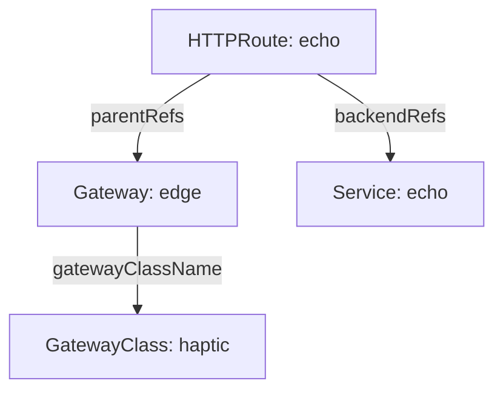

# Route with Gateway API

Use a Gateway to define your listening ports and an HTTPRoute to send matching
requests to a Kubernetes Service. HAPTIC creates the `haptic` GatewayClass that
connects those Gateways to your installation.

## Prerequisites

[Install HAPTIC](./getting-started.md#install-with-helm) if it isn't running yet.
If your cluster doesn't have the Gateway API CRDs, install the standard channel:

```bash
kubectl apply -f https://github.com/kubernetes-sigs/gateway-api/releases/download/v1.6.0/standard-install.yaml
```

This walkthrough uses HTTPRoute from the standard channel. For other route
kinds or an existing CRD installation, check
[version and channel support](libraries/gateway.md#supported-gateway-api-versions-and-channels).

Wait for HAPTIC to create the class:

```bash
kubectl wait --for=create gatewayclass/haptic --timeout=180s
```

## Expose a Service through a Gateway

This optional walkthrough routes `echo.example.local` to a sample application
using the default `haptic` class. Skip it if you're ready to configure your own
Gateway and routes.

The HTTPRoute selects a Gateway through `parentRefs` and a Service through
`backendRefs`. The Gateway selects HAPTIC's class through `gatewayClassName`:



### Step 1: Deploy a sample application

Create an echo Deployment and Service in the `default` namespace:

```bash
kubectl apply -f - <<EOF
apiVersion: apps/v1
kind: Deployment
metadata:
  name: echo
  namespace: default
spec:
  replicas: 2
  selector:
    matchLabels:
      app: echo
  template:
    metadata:
      labels:
        app: echo
    spec:
      containers:
        - name: echo
          image: ealen/echo-server:latest
          ports:
            - containerPort: 80
          env:
            - name: PORT
              value: "80"
---
apiVersion: v1
kind: Service
metadata:
  name: echo
  namespace: default
spec:
  selector:
    app: echo
  ports:
    - port: 80
      targetPort: 80
EOF
```

Wait for the sample application to become ready:

```bash
kubectl rollout status deployment/echo --namespace default --timeout=120s
```

### Step 2: Create a Gateway

Create a Gateway that references the `haptic` GatewayClass and opens an HTTP listener on port 80:

```bash
kubectl apply -f - <<EOF
apiVersion: gateway.networking.k8s.io/v1
kind: Gateway
metadata:
  name: edge
  namespace: default
spec:
  gatewayClassName: haptic
  listeners:
    - name: http
      protocol: HTTP
      port: 80
      allowedRoutes:
        namespaces:
          from: Same
EOF
```

The listener accepts routes from its own namespace (`default`). HAPTIC creates
a dedicated Service named `gw-default-edge` in the controller's namespace.
That Service directs traffic to this Gateway's listeners on the shared HAProxy
pods. You can test it with port forwarding even without a load balancer.

### Step 3: Create an HTTPRoute

Attach an HTTPRoute to the Gateway that forwards `echo.example.local` to the echo Service:

```bash
kubectl apply -f - <<EOF
apiVersion: gateway.networking.k8s.io/v1
kind: HTTPRoute
metadata:
  name: echo
  namespace: default
spec:
  parentRefs:
    - name: edge
  hostnames:
    - echo.example.local
  rules:
    - matches:
        - path:
            type: PathPrefix
            value: /
      backendRefs:
        - name: echo
          port: 80
EOF
```

Other hostnames don't match this route.

### Step 4: Test the routing

Port-forward to this Gateway's Service:

```bash
kubectl port-forward -n haptic svc/gw-default-edge 8080:80
```

In another terminal:

```bash
curl -H "Host: echo.example.local" http://localhost:8080/
```

You receive a response from the echo server. Inspect the Gateway's address and
conditions, and the HTTPRoute's attachment status:

```bash
kubectl get gateway edge -n default -o yaml
kubectl get httproute echo -n default -o yaml
```

For the route, inspect the parent entry for `edge`: `Accepted=True` means the
Gateway accepts the route, and `ResolvedRefs=True` means its references resolve.
If either is false, read its reason and message before testing again.

Without a load-balancer implementation, the Service's external IP remains
pending. Port forwarding gives you local access while you arrange external
access; inspect the Gateway conditions before directing public traffic to it.

For every route type (HTTP, gRPC, TLS, TCP), listener option, and status condition, see the [Gateway API library](./libraries/gateway.md).

### Remove the sample

Stop port forwarding with **Ctrl+C**, then remove the resources from this
walkthrough:

```bash
kubectl delete httproute echo -n default
kubectl delete gateway edge -n default
kubectl delete service echo -n default
kubectl delete deployment echo -n default
```

To change the class name or manage it separately, see [GatewayClass settings](gateway-class.md).
