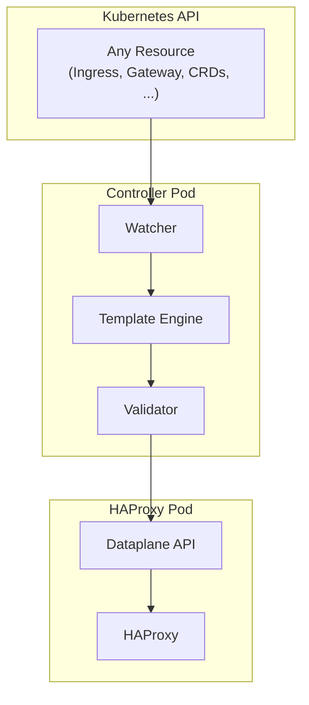

# HAPTIC

**HAPTIC** (HAProxy Template Ingress Controller) is a template-driven [HAProxy](https://www.haproxy.org/) Ingress Controller for Kubernetes that generates HAProxy configurations using [Scriggo](https://scriggo.com/) templates and deploys them via the [HAProxy Dataplane API](https://github.com/haproxytech/dataplaneapi).


!!! note "Community Project"
    This is an independent community project and is not affiliated with or endorsed by HAProxy Technologies.

## What is HAPTIC?

HAPTIC is an event-driven Kubernetes controller that:

- **Watches any Kubernetes resource** - Ingresses, Services, Secrets, Gateway API resources, or any custom resource type you configure
- **Renders Scriggo templates** - A fast, Go-native template engine
- **Validates before deployment** - Deploy with confidence knowing configurations are validated before they reach your load balancers
- **Deploys configurations** to HAProxy pods via the Dataplane API

Unlike traditional ingress controllers with hardcoded configuration logic, HAPTIC uses a template-driven approach that gives you full control over the generated HAProxy configuration. This means you can:

- **Define custom annotations** that your platform users can use, implemented with just a few lines of template code
- **Support new standards** like Gateway API without waiting for controller updates
- **Watch domain-specific CRDs** and generate HAProxy configuration from any Kubernetes resource type

## Key Features

### Template-Driven Flexibility

Traditional ingress controllers embed configuration logic in code. HAPTIC inverts this:

- **Full HAProxy access** - Write any HAProxy directive using the [configuration language](https://www.haproxy.com/documentation/haproxy-configuration-manual/latest/)
- **Add features without code changes** - New directives are template updates, not controller releases
- **Iterate rapidly** - Deploy configuration changes in minutes, not release cycles
- **Rich template context** - Access any Kubernetes resource, fetch external data via HTTP, and use controller state in your templates
- **Everything is templatable** - Generate not just `haproxy.cfg` but also map files, SSL certificates, CRT-lists, and custom auxiliary files

### Production Ready

- **High availability** - Leader election with automatic failover
- **Comprehensive validation** - Validating webhook, template validation, and CI/CD-runnable tests
- **Observability** - Prometheus metrics, structured logging, and debug endpoints
- **HTTP resource access** - Fetch external data for use in templates

!!! note "Ready to use out of the box"
    The [Helm chart](deploying-with-helm.md) ships with [Template Libraries](template-libraries.md) enabled by default. They cover Kubernetes Ingress and Gateway API resources with annotation support comparable to existing HAProxy ingress controllers — no template authoring required. Customizing or extending the templates is entirely optional.

## Architecture

The controller follows an event-driven architecture where changes to Kubernetes resources trigger a pipeline that renders templates, validates the output, and syncs configurations to HAProxy pods.



Key components:

- **Watcher** - Subscribes to Kubernetes API for configured resource types
- **Template Engine** - Renders Scriggo templates with resource data as context
- **Validator** - Validates generated HAProxy configuration before deployment
- **Dataplane Syncer** - Applies configuration changes to HAProxy pods via the Dataplane API

## Quick Start

```bash
helm install my-controller oci://registry.gitlab.com/haproxy-haptic/haptic/charts/haptic --version 0.2.0-alpha.1
```

This installs both the controller and a 2-replica HAProxy Deployment, plus the default template libraries that cover Ingress and Gateway API out of the box. For the full walkthrough — including a sample app and end-to-end verification — see [Getting Started](getting-started.md).

### Inspect the Deployed Configuration

Once you have an Ingress (or Gateway, HTTPRoute, …) the controller writes the rendered HAProxy config to a read-only `HAProxyCfg` CRD on every reconciliation:

```bash
kubectl describe haproxycfg -n haptic
```

!!! note "CRD short names"
    `HAProxyCfg` (singular `haproxycfg`, short name `hpcfg`) is the *output*. The *input* — templates, watched resources, dataplane settings — lives in `HAProxyTemplateConfig` (short names `htplcfg`, `haptpl`). Edit that one, not `HAProxyCfg`. Use `kubectl describe` rather than `kubectl get -o yaml`, since the latter renders multiline configs as literal `\n`.

### What Makes HAPTIC Different

The killer feature is templates. Suppose your platform users want a custom annotation that injects an `X-Request-ID` header for tracing. Add a snippet to your Helm values — no controller fork, no waiting for a release:

```yaml
controller:
  config:
    templateSnippets:
      # The frontend-filters-* glob picks this up automatically; the 300 prefix
      # places it alongside the built-in header-manipulation snippets.
      frontend-filters-300-request-id:
        template: |
          
          
          
          http-request set-header {{ header }} %[uuid()]
          
          
```

Users opt in per-Ingress with `example.com/request-id-header: "X-Request-ID"`. The same pattern works for rate limiting, header rewrites, custom ACLs — anything HAProxy can express. Override any snippet, replace the main template, or disable all libraries and start from scratch. See the [Templating Guide](templating.md).

## Where to Go Next

- **Essential**: [Getting Started](getting-started.md) → [Templating](templating.md) → [CRD Reference](crd-reference.md)
- **Custom resources beyond Ingress**: [Watching Resources](watching-resources.md)
- **Template tests for CI/CD**: [Validation Tests](validation-tests.md)
- **Reference**: [Supported Configuration](supported-configuration.md), [Troubleshooting](troubleshooting.md)
- **Helm chart configuration**: [Helm Chart Documentation](deploying-with-helm.md)
