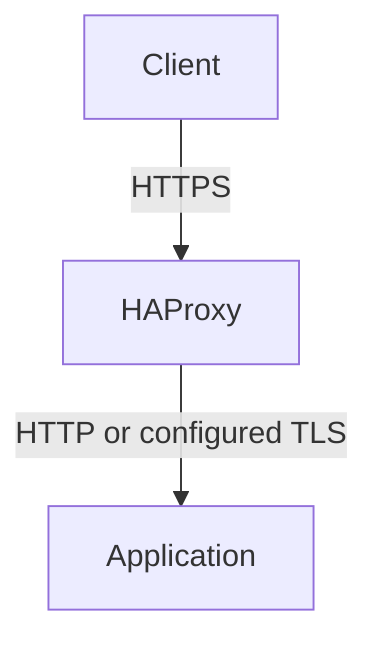

---
search:
  boost: 2
---

# TLS certificates

<a id="ssl-certificates"></a>

The [Helm chart](deploying-with-helm.md) creates a default certificate for HTTPS.
It uses cert-manager when available, or generates a self-signed Secret otherwise.
For public traffic, supply a trusted certificate for your hostnames. Choose
[cert-manager](#production-deployment) for automatic renewal or
[an existing certificate](#alternative-manual-certificate) from your issuer.
Controller-to-agent certificates are separate; see [agent certificates](operations/agent-certificates.md).

## Choose which connection to secure

Client HTTPS and backend TLS are separate connections. A certificate on an
Ingress or Gateway secures the client connection; it doesn't enable TLS to
the application:



| Connection | Configure |
| --- | --- |
| Client to an Ingress | A TLS Secret in [`spec.tls`](libraries/ingress.md#tls-configuration) |
| Client to a Gateway | An [HTTPS listener](#gateway-api) |
| HAProxy to an application | [Ingress backend TLS](libraries/haptic-annotations.md#backend-tls-to-the-upstream) or [Gateway BackendTLSPolicy](libraries/gateway.md#gateway-tls-policies) |

For client HTTPS, an exact hostname takes precedence over a wildcard. The
default certificate covers unmatched hostnames and clients that send no
Server Name Indication (SNI).

## Default SSL certificate

### Default behavior (development/testing)

The chart creates a self-signed certificate for `localdev.me` and `*.localdev.me`:

- **cert-manager installed** (the `cert-manager.io/v1` API is present when Helm renders): the chart creates a self-signed `Issuer` named `<fullname>-ssl-selfsigned` and a `Certificate`; cert-manager provisions the `default-ssl-cert` Secret and renews it before expiry.
- **cert-manager absent**: the chart generates a self-signed `default-ssl-cert` Secret itself, for the same DNS names. This certificate is valid for 10 years and **isn't** auto-rotated. The Secret survives uninstall and upgrade (`helm.sh/resource-policy: keep`), and the chart only generates it when the Secret doesn't already exist — a Secret you created out-of-band is left untouched.

The `localdev.me` domain resolves to `127.0.0.1` for local testing. For clients
to trust your public endpoint, use a certificate from their trusted issuer.

!!! warning "GitOps tools that render without cluster access"
    The no-cert-manager fallback checks for an existing Secret with Helm's `lookup` function, which returns nothing when the chart is rendered without cluster access (`helm template`, Argo CD) — every sync would then generate a fresh certificate. For those deployments, install cert-manager, or provide the certificate explicitly: inline via `defaultSSLCertificate.create`/`cert`/`key` together with `defaultSSLCertificate.certManager.enabled=false`, or as a manually created Secret (see [Alternative: Manual Certificate](#alternative-manual-certificate)). The chart rejects inline creation while cert-manager is enabled because two actors must not own the same Secret.

### Production deployment

For production, override the default certificate configuration with your actual domain and a trusted issuer:

```yaml
defaultSSLCertificate:
  certManager:
    createIssuer: false  # Use your own issuer
    dnsNames:
      - "app.example.com"
    issuerRef:
      name: letsencrypt-prod
      kind: ClusterIssuer
```

This example assumes cert-manager and a `letsencrypt-prod` ClusterIssuer are
already configured. Point your hostname at HAPTIC. For an HTTP-01 issuer, the
hostname must be publicly reachable on port 80; see
[cert-manager HTTP-01 setup](https://cert-manager.io/docs/configuration/acme/http01/).

Apply the values through your [Helm deployment](deploying-with-helm.md#change-settings). The chart creates a Certificate
resource; cert-manager provisions and renews its TLS Secret. For a wildcard such
as `*.example.com`, use a [DNS-01 issuer](https://cert-manager.io/docs/configuration/acme/dns01/)
instead: HTTP-01 can't issue wildcard certificates.

### Alternative: Manual certificate

Obtain a certificate for your domain and save its PEM certificate chain as
`tls.crt` and its private key as `tls.key`. Create a Secret with a new name so
you don't overwrite one managed by Helm or cert-manager:

```bash
kubectl create namespace haptic --dry-run=client -o yaml | kubectl apply -f -
kubectl create secret tls app-default-tls \
  --cert=tls.crt --key=tls.key --namespace=haptic
```

Then add these settings to your [Helm values](deploying-with-helm.md#change-settings)
and install or upgrade HAPTIC:

```yaml
defaultSSLCertificate:
  secretName: app-default-tls
  certManager:
    enabled: false
```

You are responsible for [renewing this certificate](#certificate-rotation).

### Custom certificate names

To use a different Secret name or namespace:

```yaml
defaultSSLCertificate:
  secretName: "my-wildcard-cert"
  namespace: "certificates"
```

The controller references the Secret at `certificates/my-wildcard-cert`. To use
an existing Secret, also set `defaultSSLCertificate.certManager.enabled: false`
as in the manual certificate procedure above.

<a id="tls-secret-format"></a>

`kubectl create secret tls` creates a `kubernetes.io/tls` Secret with the required
`tls.crt` and `tls.key` entries. Keep the certificate chain in `tls.crt`, starting
with the host certificate.

<a id="disabling-https"></a>

### Disable the default certificate

To require each HTTPS route to supply its own certificate, disable the default:

```yaml
defaultSSLCertificate:
  enabled: false
```

This doesn't disable HTTPS for Ingresses or Gateways with their own TLS
configuration. For an HTTP-only installation, also leave those routes without
TLS configuration and don't configure TLS passthrough.

### Certificate rotation

**With cert-manager**: Certificates are automatically renewed before expiration.

**Chart-generated self-signed Secret** (no cert-manager): never rotated automatically — it's valid for 10 years. Replace it like a manual certificate if you need a different one.

**Manual certificates**: Update the Secret before the old certificate expires.
For the `app-default-tls` Secret created above:

```bash
# Update Secret with new certificate
kubectl create secret tls app-default-tls \
  --cert=new-tls.crt \
  --key=new-tls.key \
  --namespace=haptic \
  --dry-run=client -o yaml | kubectl apply -f -
```

The controller watches the Secret and automatically deploys the updated certificate to HAProxy.

### SSL troubleshooting

For SSL symptom diagnosis — "Secret not found" errors, HAProxy failing to start with SSL errors, or a certificate that isn't updating — see [Troubleshooting → SSL/TLS Issues](./troubleshooting.md#ssltls-issues).

## HTTP strict transport security (HSTS)

To send the `Strict-Transport-Security` response header on every HTTPS response — across all TLS hosts — set these Helm values:

```yaml
controller:
  config:
    templatingSettings:
      extraContext:
        tls:
          hsts:
            enabled: true
            maxAge: "31536000"          # one year (default)
            includeSubdomains: false
            preload: false
```

HSTS takes effect only over HTTPS, so pair it with an HTTP-to-HTTPS redirect. The rendered config emits a warning when HSTS is on but no redirect is configured.

This sets the header for every host. To enable HSTS per host instead — or override the global value for specific hosts — use the per-Ingress `hsts` annotations (see [Annotations](annotations.md)). A per-Ingress annotation wins over the global default for its hosts.

## TLS cipher suites and protocol versions

The default TLS policy allows TLS 1.2 and 1.3, with cipher suites for RSA and
ECDSA certificates. Set `extraContext.tls` to change that policy for all HTTPS
listeners:

These are the chart defaults:

<!-- The cipher/ciphersuite defaults below mirror the chart default in
     charts/haptic/charts/ssl/library.yaml (extraContext.tls). Keep them in sync. -->

```yaml
controller:
  config:
    templatingSettings:
      extraContext:
        tls:
          # TLS 1.2 cipher list          → ssl-default-bind-ciphers
          ciphers: "ECDHE-ECDSA-CHACHA20-POLY1305:ECDHE-RSA-CHACHA20-POLY1305:ECDHE-ECDSA-AES128-GCM-SHA256:ECDHE-RSA-AES128-GCM-SHA256:ECDHE-ECDSA-AES256-GCM-SHA384:ECDHE-RSA-AES256-GCM-SHA384:DHE-RSA-AES128-GCM-SHA256:DHE-RSA-AES256-GCM-SHA384:ECDHE-ECDSA-AES128-SHA256:ECDHE-RSA-AES128-SHA256:ECDHE-ECDSA-AES128-SHA:ECDHE-RSA-AES128-SHA:ECDHE-ECDSA-AES256-SHA:ECDHE-RSA-AES256-SHA:DHE-RSA-AES128-SHA256:DHE-RSA-AES256-SHA256:DHE-RSA-AES128-SHA:DHE-RSA-AES256-SHA"
          # TLS 1.3 cipher suites         → ssl-default-bind-ciphersuites
          ciphersuites: "TLS_AES_128_GCM_SHA256:TLS_AES_256_GCM_SHA384:TLS_CHACHA20_POLY1305_SHA256"
          # Minimum protocol version      → ssl-default-bind-options ssl-min-ver
          minVersion: "TLSv1.2"
```

You override one sub-key without restating the others — Helm deep-merges your value with the defaults. Set any value to an empty string (`""`) to omit its directive and fall back to HAProxy's built-in default. Per-listener Gateway TLS options still override this policy for their own bind.

<a id="it-works-with-whatever-certificate-you-provide"></a>

### Certificate algorithm compatibility

The default cipher policy supports RSA, ECDSA, and [dual certificates](#dual-rsa-and-ecdsa-certificates). You don't need a separate cipher list for each key type.

### Supporting legacy clients

Check which protocols and cipher suites the client supports before changing the
policy. For a TLS 1.2 client that requires static-RSA key exchange, this example
adds static-RSA suites to the default cipher list. Those connections lose
forward secrecy:

```yaml
controller:
  config:
    templatingSettings:
      extraContext:
        tls:
          ciphers: "ECDHE-ECDSA-CHACHA20-POLY1305:ECDHE-RSA-CHACHA20-POLY1305:ECDHE-ECDSA-AES128-GCM-SHA256:ECDHE-RSA-AES128-GCM-SHA256:ECDHE-ECDSA-AES256-GCM-SHA384:ECDHE-RSA-AES256-GCM-SHA384:DHE-RSA-AES128-GCM-SHA256:DHE-RSA-AES256-GCM-SHA384:ECDHE-ECDSA-AES128-SHA256:ECDHE-RSA-AES128-SHA256:ECDHE-ECDSA-AES128-SHA:ECDHE-RSA-AES128-SHA:ECDHE-ECDSA-AES256-SHA:ECDHE-RSA-AES256-SHA:DHE-RSA-AES128-SHA256:DHE-RSA-AES256-SHA256:DHE-RSA-AES128-SHA:DHE-RSA-AES256-SHA:AES128-GCM-SHA256:AES256-GCM-SHA384:AES128-SHA256:AES256-SHA256:AES128-SHA:AES256-SHA"
          minVersion: "TLSv1.2"
```

Static-RSA suites require an RSA certificate. Change the minimum TLS version
only if the client's protocol support also requires it; a cipher mismatch alone
doesn't require allowing TLS 1.0 or 1.1.

## Dual RSA and ECDSA certificates

You can serve both an ECDSA and an RSA certificate for the same host. HAProxy presents the ECDSA certificate to clients that support it — a smaller, faster handshake — and falls back to the RSA certificate for older clients. It selects per connection from the client's capabilities, so you don't choose which to serve; you provide both.

The setup is always two steps: issue **two** `kubernetes.io/tls` Secrets for the host (one ECDSA, one RSA), then reference **both** from whatever fronts the host — an Ingress, a Gateway listener, or the chart's default certificate. HAPTIC writes every referenced certificate into HAProxy's certificate list under the host's SNI.

### Issue the two certificates (cert-manager)

Create two Certificate resources for the same DNS names, one per key algorithm:

```yaml
apiVersion: cert-manager.io/v1
kind: Certificate
metadata:
  name: app-ecdsa
  namespace: my-app
spec:
  secretName: app-tls-ecdsa
  dnsNames: ["app.example.com"]
  privateKey:
    algorithm: ECDSA
    size: 256
  issuerRef:
    name: letsencrypt-prod
    kind: ClusterIssuer
---
apiVersion: cert-manager.io/v1
kind: Certificate
metadata:
  name: app-rsa
  namespace: my-app
spec:
  secretName: app-tls-rsa
  dnsNames: ["app.example.com"]
  privateKey:
    algorithm: RSA
    size: 2048
  issuerRef:
    name: letsencrypt-prod
    kind: ClusterIssuer
```

Use an issuer that supports both key algorithms. For a wildcard certificate,
use a [DNS-01 issuer](https://cert-manager.io/docs/configuration/acme/dns01/);
HTTP-01 can't validate wildcards.

### Ingress

Reference both Secrets from the Ingress with two `spec.tls` entries for the same host:

```yaml
apiVersion: networking.k8s.io/v1
kind: Ingress
metadata:
  name: app
  namespace: my-app
spec:
  ingressClassName: haptic
  tls:
    - hosts: ["app.example.com"]
      secretName: app-tls-ecdsa
    - hosts: ["app.example.com"]
      secretName: app-tls-rsa
  rules:
    - host: app.example.com
      http:
        paths:
          - path: /
            pathType: Prefix
            backend:
              service:
                name: app
                port:
                  number: 80
```

A single-algorithm setup needs only one Certificate and one `spec.tls` entry.
The default cipher policy supports [RSA and ECDSA certificates](#certificate-algorithm-compatibility).

### Gateway API

A Gateway HTTPS listener takes a **list** of certificate references, so serve dual by giving it both Secrets:

```yaml
apiVersion: gateway.networking.k8s.io/v1
kind: Gateway
metadata:
  name: app
  namespace: my-app
spec:
  gatewayClassName: haptic
  listeners:
    - name: https
      protocol: HTTPS
      port: 443
      hostname: app.example.com
      tls:
        mode: Terminate
        certificateRefs:
          - kind: Secret
            name: app-tls-ecdsa
          - kind: Secret
            name: app-tls-rsa
```

HAPTIC emits both certificates into that listener's certificate list under its hostname, exactly as it does for an Ingress.

### Default certificate

The default certificate is what HAProxy serves when a connection sends no SNI, or an SNI that matches no configured host. It's set once for the whole controller through `defaultSSLCertificate`, and it can be dual as well — useful when a **wildcard** default (for example `*.example.com`) fronts many teams' hosts and you want the faster ECDSA handshake there without each team managing its own certificate.

Point `defaultSSLCertificate.secretName` at the primary (RSA) Secret and set `defaultSSLCertificate.ecdsaSecretName` to the ECDSA companion:

```yaml
defaultSSLCertificate:
  secretName: wildcard-rsa-tls         # primary, e.g. RSA *.example.com
  ecdsaSecretName: wildcard-ecdsa-tls  # ECDSA companion for the same names
  certManager:
    enabled: false  # The Secrets already exist
```

Both Secrets must live in the same namespace (`defaultSSLCertificate.namespace`, which defaults to the release namespace). HAPTIC then emits two default certificate-list lines and HAProxy serves ECDSA to modern clients and the primary certificate to the rest on the default path.

For a **single-algorithm** default, leave `ecdsaSecretName` empty (the default) and put whichever certificate you want in `secretName` — an RSA cert for RSA-only, or an ECDSA cert for ECDSA-only. `secretName` is the default certificate regardless of key type; `ecdsaSecretName` only adds the second, ECDSA-preferred certificate when you want both.

!!! note "Gateway-owned default"
    If a Gateway HTTPS listener with no `hostname` claims the default slot, that listener owns the default certificate — give *it* two `certificateRefs` for a dual default there. `ecdsaSecretName` applies to the chart's `defaultSSLCertificate`, not to a Gateway-owned default.

## TLS session resumption

TLS session resumption reduces handshake work when a client reconnects. A session
ticket lets the client reuse parameters from a previous connection.

Enable shared ticket keys so clients can resume sessions across HAProxy pods.
Shared keys are off by default; that setting doesn't disable HAProxy's own
session resumption:

```yaml
controller:
  config:
    templatingSettings:
      extraContext:
        tls:
          sessionTickets:
            enabled: true
```

### Key rotation

On the first render of a new day in Coordinated Universal Time (UTC), HAPTIC appends a new random key and removes
the oldest, retaining three keys. HAProxy uses the middle key to issue tickets
and all three to decrypt them, as described in the
[HAProxy ticket-key reference](https://docs.haproxy.org/3.4/configuration.html#5.1-tls-ticket-keys).
Rotation takes effect through a configuration reload. Whether a client can
resume also depends on its ticket lifetime and the server's session settings.

## Webhook certificates

<a id="supply-your-own-webhook-certificate"></a>

Admission webhook certificates protect Kubernetes configuration changes. Use
[webhook certificate management](operations/webhook-certificates.md) for their
renewal, cert-manager setup, and manual CA bundles.

## See also

- [Security](./operations/security.md) — webhook hardening, RBAC, and network exposure
- [Troubleshooting](./troubleshooting.md) — SSL symptom diagnosis and general debugging
